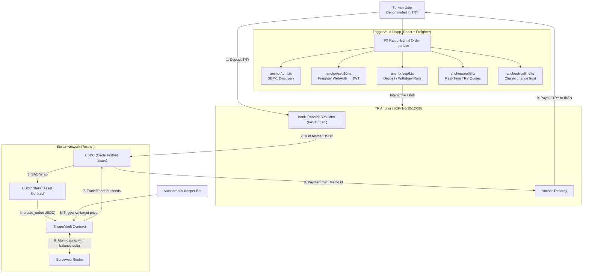

# TriggerVault ⚡

> **Autonomous FX Hedging & Non-Custodial Order Settlement on Stellar**
> Built for the Rise In × Stellar Pro Hackathon 2026.

**[▶ Live demo](https://trigger-vault-mu.vercel.app)** · [Vault contract on Stellar Expert](https://stellar.expert/explorer/testnet/contract/CAVF2IT2KTOES576A2WNIIQVIBNHWVGMSIRE55XFJGB6WD3R4HWP2INT) · Stellar Testnet

---

## The problem

A freelancer in Istanbul invoices in USD and spends in lira. To protect a rate they
have three bad options: watch the chart themselves, leave funds on a centralised
exchange that can freeze the account, or hand keys to a custodial bot.

TriggerVault gives them the fourth: a limit order that rests **on-chain**, priced in
lira, executed by anyone, with collateral that never leaves a Soroban contract. Money
enters and leaves through a Turkish bank transfer over SEP-6, so the user never has to
think in stablecoins.

---

## Live deployment

| | Address / URL |
| --- | --- |
| **dApp** | <https://trigger-vault-mu.vercel.app> |
| **Vault contract** | [`CAVF2IT2…R4HWP2INT`](https://stellar.expert/explorer/testnet/contract/CAVF2IT2KTOES576A2WNIIQVIBNHWVGMSIRE55XFJGB6WD3R4HWP2INT) |
| **USDC SAC** | [`CBIELTK6…HMXQDAMA`](https://stellar.expert/explorer/testnet/contract/CBIELTK6YBZJU5UP2WWQEUCYKLPU6AUNZ2BQ4WWFEIE3USCIHMXQDAMA) |
| **USDC issuer** | [`GBBD47IF…3ZLLFLA5`](https://stellar.expert/explorer/testnet/account/GBBD47IF6LWK7P7MDEVSCWR7DPUWV3NY3DTQEVFL4NAT4AQH3ZLLFLA5) |
| **Native XLM SAC** | [`CDLZFC3S…U2HHGCYSC`](https://stellar.expert/explorer/testnet/contract/CDLZFC3SYJYDZT7K67VZ75HPJVIEUVNIXF47ZG2FB2RMQQVU2HHGCYSC) |
| **Soroswap router** | [`CCJUD55A…64UZZE7BRD`](https://stellar.expert/explorer/testnet/contract/CCJUD55AG6W5HAI5LRVNKAE5WDP5XGZBUDS5WNTIVDU7O264UZZE7BRD) |
| **TRY anchor** (sandbox) | <https://tr-mock-anchor.fly.dev> — SEP-1/6/10/12/38 |

> The anchor is a **sandbox** TRY anchor: the bank leg is simulated, the Stellar leg is a
> real testnet transaction. The client is written against the published SEPs and holds no
> anchor-specific logic past the home domain — discovery, auth, rails and quotes are all
> read from the anchor's own TOML and `/info`. Moving to a production anchor is a
> configuration change on our side, but it is gated on that provider's KYC requirements,
> supported rails and commercial onboarding, not on a one-line edit.

### Verified on-chain

Every hash below is a real, successful Stellar Testnet transaction, read back from
Soroban RPC and Horizon rather than from the UI.

| Step | Transaction |
| --- | --- |
| **SEP-6 deposit** — anchor pays out 61.1895780 USDC | [`65434cdf…411d66`](https://stellar.expert/explorer/testnet/tx/65434cdf31f19aa23d6408da4c3b6bf32587f3a169fadfa4088e44bbdb411d66) |
| **WASM upload** — `d9ad61c2…10142c` | [`4c7caedb…f67d5d`](https://stellar.expert/explorer/testnet/tx/4c7caedb946665fd72275ba4b2da4b70e709f2f9ff7c9c05b144c403e1f67d5d) |
| **Contract deployment** | [`b89acbde…e049f0`](https://stellar.expert/explorer/testnet/tx/b89acbde43a36151551139de7f9629a8763a8f91ac8bd4ac2abd903c15e049f0) |
| **`init`** — admin + Soroswap router | [`3dbdbdce…2343a5`](https://stellar.expert/explorer/testnet/tx/3dbdbdce447fc153728760dbc78a6760512ae5534c9571f28afec62c652343a5) |
| **`create_order`** — 10 XLM escrowed, net floor 1.0008955 USDC, 100 bps bounty | [`b259cb51…8f4f82`](https://stellar.expert/explorer/testnet/tx/b259cb518287aca4e13efc1390cb24c4639c5cec0ffbaea4b4c50b70e18f4f82) |
| **`execute_order`** — real Soroswap fill, 1.0535743 USDC realised | [`3b2e80ce…2080ef`](https://stellar.expert/explorer/testnet/tx/3b2e80cef75ab2381ffef82c7421f1e43bd132fbc62740746c7b5a4c612080ef) |

#### What `3b2e80ce…` actually did

The settlement transaction is the whole thesis in one ledger entry. Decoded from its
contract events, in order:

| Event | Amount | Meaning |
| --- | --- | --- |
| `transfer` XLM — vault → Soroswap pair | `100000000` (10.0000000) | The router **pulled** the input under a scoped sub-invocation. The vault never approved a blanket allowance. |
| `transfer` USDC — Soroswap pair → vault | `10535743` (1.0535743) | The fill arrives at the vault, not at the user. |
| `SoroswapPair` `sync` / `swap` | `amount_1_in 100000000`, `amount_0_out 10535743` | A real pool — [`CCBX3NZT…`](https://stellar.expert/explorer/testnet/contract/CCBX3NZTCQLQFSPG7HBOKL4P2RVPOPVFHDNRTOSCCJWBTPL2GHEH7RQS), not a mock. |
| `SoroswapRouter` `swap` | `path [XLM SAC, USDC SAC]` | Emitted by [`CCJUD55A…`](https://stellar.expert/explorer/testnet/contract/CCJUD55AG6W5HAI5LRVNKAE5WDP5XGZBUDS5WNTIVDU7O264UZZE7BRD), the published Soroswap testnet router. |
| `transfer` USDC — vault → executor | `105357` (0.0105357) | Keeper bounty: 100 bps of the **observed delta**. |
| `transfer` USDC — vault → owner | `10430386` (1.0430386) | Net proceeds to the order's owner. |
| `order` `execute` | `(1, executor, 10535743, 105357)` | The vault's own receipt: order id, who executed, gross realised, bounty paid. |

`105357 + 10430386 = 10535743` — the two payouts reconcile exactly against the balance
delta the contract measured. The order's floor was **1.0008955 USDC net**, and the owner
received 1.0430386: the guarantee is checked against the figure that actually reached the
wallet, not against the swap output the bounty is later carved from. The order's on-chain
`status` is now `Executed`.

> **Read honestly:** in this transaction the executor and the owner are the same account,
> because the order was created and settled by the same key while proving the deployment.
> The bounty is a real, separate transfer computed by the contract — but a distinct keeper
> address would make the split visually obvious. `keeper/` runs the same `execute_order`
> call with its own key.

#### Both lifecycles, driven from the deployed app

The settlement above was signed from the command line. These two orders were placed and
closed entirely through <https://trigger-vault-mu.vercel.app> — the form, the **Execute**
button and the **Cancel** button — by a Freighter wallet, `GAJGMHHG…OSSLR`. Both live on
**V2**, so their minimum is a **net** floor: `min_user_out` is what must reach the wallet
*after* the keeper bounty.

| Order | Step | Transaction |
| --- | --- | --- |
| `CAVF2IT2…WP2INT:2` | **`create_order`** — 10 XLM escrowed, net floor 1.0100000 USDC, 100 bps bounty | [`32252915…cd040b`](https://stellar.expert/explorer/testnet/tx/32252915c3f6028dc4faa4e275a3fac1f1b5c07badb398571177736a7ccd040b) |
| `CAVF2IT2…WP2INT:2` | **`execute_order`** — real Soroswap fill, 1.0535845 USDC realised | [`2d876f45…b39338`](https://stellar.expert/explorer/testnet/tx/2d876f454743e949d67bd2c38a5d6f63507e224581f6ea74c3ed27037fb39338) |
| `CAVF2IT2…WP2INT:3` | **`create_order`** — 10 XLM escrowed, identical terms | [`e6b68d4d…bf0513`](https://stellar.expert/explorer/testnet/tx/e6b68d4dee0d622c179ef6af33fc89b369bef3d6bd300a8797b9ece6f6bf0513) |
| `CAVF2IT2…WP2INT:3` | **`cancel_order`** — 10.0000000 XLM returned | [`e395ebd3…ae5aa8`](https://stellar.expert/explorer/testnet/tx/e395ebd34d8236b11b8db50dc96f1304dae9ccb8c5601a6c1ef17ca0e1ae5aa8) |

Order ids are written `contractId:orderId` because ids restart at 1 in every deployment —
`#2` names three different orders across V0, V1 and V2. Order `#3` was a duplicate of `#2`:
the form was submitted a second time, 45 seconds later, at the next account sequence
number. Rather than leave it resting, it became the cancellation test.

**`2d876f45…` — execute, decoded from its contract events:**

| Event | Amount | Meaning |
| --- | --- | --- |
| `transfer` XLM — vault → Soroswap pair | `100000000` (10.0000000) | The router pulled the collateral under the scoped sub-invocation. |
| `transfer` USDC — Soroswap pair → vault | `10535845` (1.0535845) | Gross realised, measured by the vault as its own balance delta. |
| `SoroswapPair` `sync` / `swap` | `amount_1_in 100000000`, `amount_0_out 10535845` | The same real pool [`CCBX3NZT…`](https://stellar.expert/explorer/testnet/contract/CCBX3NZTCQLQFSPG7HBOKL4P2RVPOPVFHDNRTOSCCJWBTPL2GHEH7RQS). |
| `transfer` USDC — vault → executor | `105358` (0.0105358) | Keeper bounty, 100 bps of the observed delta. |
| `transfer` USDC — vault → owner | `10430487` (1.0430487) | Net proceeds to the order's owner. |
| `order` `execute` | `(2, executor, 10535845, 105358)` | The vault's receipt, naming the bounty separately. |

`105358 + 10430487 = 10535845` — the two payouts reconcile exactly against the gross the
contract measured. The floor was **1.0100000 USDC net** and the owner received
**1.0430487**, so `1.0430487 ≥ 1.0100000` held on the figure that actually reached the
wallet. Network fee, charged separately from either payout: 41 092 stroops (0.0041092 XLM).
`get_order(2).status` is now `Executed`.

> **Read honestly, again:** the wallet that owned order `#2` is the wallet that pressed
> **Execute**, so both transfers above landed in the same account and its USDC balance rose
> by the gross 1.0535845. That total is *not* the net payout. The bounty and the net are two
> separate `transfer` events, computed separately by the contract, and only the second is
> what `min_user_out` guards.

**`e395ebd3…` — cancel, decoded the same way:**

| Event | Amount | Meaning |
| --- | --- | --- |
| `transfer` XLM — vault → owner | `100000000` (10.0000000) | The full collateral, returned to the owner's wallet. |
| `order` `cancel` | `3` | The order's receipt. |

The refund is the escrowed amount to the stroop — `100000000` in, `100000000` back — and
`get_order(3).status` is now `Cancelled`. The 16 177 stroops (0.0016177 XLM) of network fee
were charged to the account as a separate ledger entry, not deducted from the refund: this
is why the refund is read from the `transfer` event rather than from the wallet's balance
delta. No swap is attempted on a cancellation, so the bounty and the floor never apply.

Every figure above was decoded from each transaction's `TransactionMeta` through Soroban
RPC, not read off the UI, and the order statuses were re-read from the contract afterwards.

The on-chain WASM hash `d9ad61c2…10142c` matches the local `cargo build --release` output
byte for byte, so the code above is the code these 17 tests cover. Verify it yourself:

```bash
cd contracts/vault && cargo build --release --target wasm32-unknown-unknown
shasum -a 256 target/wasm32-unknown-unknown/release/trigger_vault.wasm
stellar contract fetch --id CAVF2IT2KTOES576A2WNIIQVIBNHWVGMSIRE55XFJGB6WD3R4HWP2INT \
  --network testnet --out-file onchain.wasm && shasum -a 256 onchain.wasm
```

<details>
<summary>Earlier contract instances — and why the console still lists them</summary>

Order ids restart at 1 in every deployment, and collateral does not move when a new one
goes up. Retiring a vault by pointing a constant at a new address would quietly orphan
whatever the old one still holds, so `frontend/src/vaults.ts` keeps a **list**: earlier
vaults stay readable and cancellable, and only the newest accepts new orders.

**V1 — [`CDVJV6SI…WK3BNTWD`](https://stellar.expert/explorer/testnet/contract/CDVJV6SITYH2A4CNTG4YG5CDYDRM5ABTDIBA3UVBLXFQNE6FWK3BNTWD)** · four resting orders · *gross* minimum

Fully working, and its settlement is real: `execute_order`
[`7b135e3d…578179`](https://stellar.expert/explorer/testnet/tx/7b135e3dfd76175b746bb015d3eb03e806dd23997979b26d3f8fce9ca0578179)
swapped 15 USDC for 141.5242761 XLM through the same Soroswap router, paying a
1.4152427 XLM bounty and 140.1090334 XLM to the owner. It was replaced because its
minimum guarded the **swap output** rather than the payout: an order guarded at 38 paid
37.62 at 100 bps. The four orders still resting there remain cancellable by their owners.

**V0 — [`CDERIBD7…GYQMPB`](https://stellar.expert/explorer/testnet/contract/CDERIBD7XORORRYYOZDM44EOJIHJWZGEBE7WTAMHJMYGWI33UKGYQMPB)** · *gross* minimum · never settled

The first deployment pushed collateral to the router before swapping. Soroswap does not
take custody — it pulls from the order's owner — so execution always reverted on an
authorization mismatch and no `execute_order` ever succeeded there. Creation and
cancellation did work:

- `create_order` — [`1352efc1…68ec5a`](https://stellar.expert/explorer/testnet/tx/1352efc105fbdbc48b2ff2c739af941473f36b0382ab48ba27e9e9e06868ec5a)
- `cancel_order` — [`a16bf08b…a39909`](https://stellar.expert/explorer/testnet/tx/a16bf08ba88b093c15a4ce7a424bf427cf6dd597467729d60e419321baa39909)

Collateral left on that instance is still reclaimable through `cancel_order`.

</details>

---

## Architecture



---

## Security model

The one design decision worth defending to a jury:

**The vault does not trust the router's return value.** `execute_order` reads the
contract's own `token_out` balance before and after the swap and uses the *observed
delta* as the realised output. The keeper bounty is taken from that delta, and what
remains is checked against `min_user_out` — the floor is a promise about the amount that
reaches the owner's wallet, not about the swap. If the owner's share falls short, the
whole transaction reverts. A router that reports a good fill while delivering less, or one
that pays out without ever taking the input, both fail — and there is a regression test
for each (`test_slippage_uses_actual_received_balance_and_reverts_atomically`,
`test_rejects_router_that_does_not_take_the_input`).

Other properties:

- **Non-custodial.** Collateral sits in the vault under the order's owner. `cancel_order`
  refunds 100% and only the creator can call it.
- **Bounded bounty.** The keeper reward is computed from the observed delta and capped at
  1,000 bps (10%). Because the floor is net, raising the bounty never quietly erodes the
  owner's guarantee — it raises the fill the order needs to settle at all.
- **Unsatisfiable orders are refused up front.** `create_order` derives the gross fill its
  floor would require and rejects the order if that cannot be represented, so collateral is
  never escrowed against a promise the contract already knows it cannot keep.
- **Scoped authorization.** The router's pull of the input is authorized through a scoped
  sub-invocation, not a blanket approval.
- **TTL managed.** Persistent entries target a ~120-day TTL, renewed under ~30 days.

Full detail: [`docs/ARCHITECTURE.md`](docs/ARCHITECTURE.md),
[`docs/SPECIFICATION.md`](docs/SPECIFICATION.md).

---

## Quickstart

```bash
git clone https://github.com/Nghtphl/trigger-vault.git && cd trigger-vault
```

**Frontend**

```bash
cd frontend && npm install && cp .env.example .env.local && npm run dev
```

Opens on <http://localhost:5173>. Requires [Freighter](https://freighter.app) set to
**Testnet**. Browsing the order queue needs no wallet; signing does.

**Contract**

```bash
cd contracts/vault
cargo test                                              # 17 tests
cargo build --release --target wasm32-unknown-unknown   # deployable wasm
```

**Keeper**

```bash
cd keeper && npm install && npm start
```

Deployment and invocation commands: [`docs/TESTNET_RUNBOOK.md`](docs/TESTNET_RUNBOOK.md).

### Environment

| Variable | Purpose |
| --- | --- |
| `VITE_VAULT_CONTRACT_ID` | Deployed TriggerVault contract |
| `VITE_RPC_URL` | Soroban RPC endpoint |
| `VITE_HORIZON_URL` | Horizon, for classic balances and trustlines |
| `VITE_ANCHOR_HOME_DOMAIN` | SEP-1 discovery root for the TRY anchor |
| `VITE_USDC_ISSUER` / `VITE_USDC_SAC_ID` | Collateral asset, classic and SAC sides |
| `VITE_TOKEN_OUT_CONTRACT_ID` | Default target asset |

All values ship in [`frontend/.env.example`](frontend/.env.example); nothing is hardcoded
past the anchor's home domain.

---

## Stellar Skills used

Cited by path, as the handbook requires.

| Skill file | Where it shows up |
| --- | --- |
| `SKILL.md` — [`CheesecakeLabs/stellar-anchor-skill`](https://github.com/CheesecakeLabs/stellar-anchor-skill) | The whole SEP-6/10/38 bridge in `frontend/src/anchor/` |
| `skills/standards/SKILL.md` — [`stellar/stellar-dev-skill`](https://github.com/stellar/stellar-dev-skill) | SEP-1 discovery (`toml.ts`), SEP-10 JWT (`sep10.ts`), SEP-38 quotes (`sep38.ts`) |
| `skills/assets/SKILL.md` | `changeTrust` trustline setup and the classic → SAC bridge (`trustline.ts`, `stellar.ts`) |
| `skills/dapp/SKILL.md` | Freighter connection, network guard and transaction signing (`frontend/src/App.tsx`) |
| `skills/smart-contracts/SKILL.md` | Soroban storage, TTL management and auth in `contracts/vault/src` |

Index: <https://skills.stellar.org/>

---

## Repository map

```
contracts/vault/   Soroban limit-order vault (Rust, no_std) + 17 tests
frontend/          React 19 + Vite dApp; anchor/ holds the SEP client
keeper/            Executor bot that settles orders when the rate is reachable
docs/              Architecture, spec, anchor integration, testnet runbook
```

---

## Roadmap — toward SCF / InstAward

TriggerVault is built to outlive the hackathon. The limit-order engine is the smallest
useful piece of a larger thesis: **Turkish users should be able to hold, hedge and exit
dollar exposure without touching a custodial exchange.**

### Q4 2026 — Submit and harden

- Submit to the **Stellar Community Fund** with the testnet deployment and this repo as
  the build record.
- Replace the sandbox anchor with a **production TRY anchor** (BiLira / TRYB is the
  first integration target — same SEP surface, so the client changes by one home domain).
- Move the keeper from manual trigger to a supervised always-on executor with
  retry, nonce management and alerting.
- Close the remaining testnet gaps: SEP-12 KYC fields and anchor-side fee disclosure.

### Q1 2027 — Audit and mainnet

- **Third-party security audit** of the vault contract, scoped to the balance-delta
  settlement path, authorization tree and TTL lifecycle.
- Mainnet deployment behind a conservative per-order cap, lifted on audit sign-off.
- Public keeper market: open bounty discovery so execution is not dependent on us.

### Q2 2027 — Distribution

- **Embedded limit-order SDK** — the vault's create/cancel/execute surface packaged for
  mobile wallets, so any Stellar wallet serving Turkish users can offer resting orders
  without shipping a contract.
- Pilot with one wallet or remittance partner reaching Turkish freelancers.
- Apply for **InstAward** continuation funding against measured usage: orders created,
  volume settled, and lira actually delivered to IBANs.

**Success metric, not vanity:** lira delivered to a bank account through an order the
user never had to watch.

---

## Documentation

| Document | Contents |
| --- | --- |
| [`docs/ARCHITECTURE.md`](docs/ARCHITECTURE.md) | System flow and storage model |
| [`docs/SPECIFICATION.md`](docs/SPECIFICATION.md) | Entrypoints, data structures, slippage and TTL semantics |
| [`docs/ANCHOR_INTEGRATION.md`](docs/ANCHOR_INTEGRATION.md) | SEP-1/6/10/12/38 integration in depth |
| [`docs/TESTNET_RUNBOOK.md`](docs/TESTNET_RUNBOOK.md) | Deploy, initialise and invoke on testnet |
| [`docs/PITCH_AND_DEFENSE.md`](docs/PITCH_AND_DEFENSE.md) | Problem framing and jury Q&A |
| [`docs/HACKATHON_READINESS.md`](docs/HACKATHON_READINESS.md) | Submission checklist |
| [`SECURITY.md`](SECURITY.md) | Disclosure policy |

---

## Licence & status

Stellar **Testnet** only. No mainnet value is at risk. Not audited — see the roadmap.
