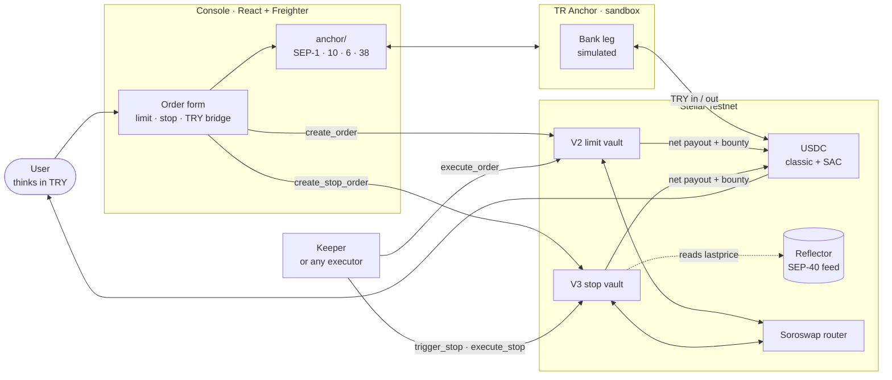

<div align="center">

# LUMAFLOW

**Non-custodial limit orders and oracle-triggered stop-loss on Stellar Soroban,
funded and cashed out in Turkish lira.**

[](https://stellar.expert/explorer/testnet)
[](docs/VERIFICATION.md)
[](docs/VERIFICATION.md#4-automated-tests)
[](SECURITY.md)

[**▶ Live demo**](https://lumaflovv.vercel.app) · [**GitHub**](https://github.com/Nghtphl/lumaflow) · [Verification record](docs/VERIFICATION.md)

*Testnet only. No mainnet value is at risk. The TRY bank leg runs against a **sandbox**
anchor — the Stellar side is real, the bank transfer is simulated.*

</div>

---

## 2. Product preview


A stop order resting in the queue — the trigger price, the net minimum and the deadline
are three separate figures, and the card says plainly that nothing has been sold:


---

## 3. Problem & solution

A freelancer in Istanbul invoices in USD and spends in lira. To protect a rate they have
three bad options: watch the chart themselves, leave funds on a centralised exchange that
can freeze the account, or hand keys to a custodial bot.

LumaFlow is the fourth: an order that rests **on-chain**, priced in lira, executable by
anyone, with collateral held in escrow by a Soroban contract until the order settles or the
owner cancels it. Money enters and leaves over SEP-6, so the user never has to think in
stablecoins.

**What is actually promised:** you will not be sold below your minimum, and you can cancel
while the order is open. Not promised: that a sale happens at all.

---

## 4. Limit orders vs stop-loss

| | **V2 — limit order** | **V3 — stop-loss** |
| --- | --- | --- |
| Sells when | the market is **good enough** to clear your floor | the **price feed falls through** your level |
| Trigger | none — any fill meeting the floor settles | Reflector SEP-40 oracle, read by the contract |
| Guarantee | `min_user_out` reaches your wallet, after the bounty | same floor, same promise |
| Pair | USDC ⇄ XLM | XLM → USDC |
| Steps | `create_order` → `execute_order` | `create_stop_order` → `trigger_stop` → `execute_stop` |
| Live proof | ✅ completed executions | ⚠️ deployed & tested, no live execution |

Both vaults accept new orders — V2 for limit, V3 for stop. They are separate deployments on
purpose: a stop order can never be settled through the limit path.

### The four rules that define a stop here

1. **Two prices, never interchangeable.** `stop_price` decides whether selling is
   *permitted*. `min_user_out` decides whether a fill is *acceptable*, and it is checked
   **after** the keeper bounty — it is a promise about what lands in your wallet.
2. **The trigger is permanent.** `trigger_stop` records the fall and moves no funds. Once
   recorded, the order stays sellable even if the price recovers, until you cancel it or the
   deadline passes. It is split from settlement so a failed swap cannot erase a fall that
   genuinely happened.
3. **Triggering is not a sale.** If the pool cannot deliver enough for `min_user_out` to
   survive the bounty, `execute_stop` reverts — and the collateral **stays in the contract**,
   still escrowed, still yours to cancel. It does not return to your wallet on its own.
4. **A stop must sit strictly below the feed.** `create_stop_order` reads the oracle and
   refuses any `stop_price` at or above the current price, so an order cannot be opened that
   would trigger on its first reading. After the deadline only `cancel_order` is open, and
   cancelling refunds the full collateral.

---

## 5. How it works

**User flow**

1. Deposit TRY by bank transfer → the sandbox anchor credits testnet USDC over SEP-6.
2. Place an order in the console: a limit order on V2, or a stop-loss on V3.
3. Sign with Freighter. The collateral moves into the vault's escrow.
4. An executor — you, or a keeper — calls the contract when the conditions are met.
5. The contract measures its own balance delta, pays the bounty, then pays you the rest.
6. Withdraw over SEP-6 to an IBAN.



The oracle is **read by the contract** during `trigger_stop` and `execute_stop`; it never
initiates anything. Both vaults pay the owner and the executor as two separate transfers.

USDC appears in two forms of the same asset: a classic asset with a trustline, and a Stellar
Asset Contract the vault holds. The console sets up the trustline over Horizon and reads the
SAC balance over Soroban RPC — there is no separate wrapping step for the user.

**Contract addresses**

| | Address |
| --- | --- |
| V2 limit vault | [`CAVF2IT2…R4HWP2INT`](https://stellar.expert/explorer/testnet/contract/CAVF2IT2KTOES576A2WNIIQVIBNHWVGMSIRE55XFJGB6WD3R4HWP2INT) |
| V3 stop vault | [`CD36555E…NQM243MBL`](https://stellar.expert/explorer/testnet/contract/CD36555E46SJ5X6WD7H6RLOCWEOHAMQLOQY55CJ4G3KGD3TNQM243MBL) |
| Reflector oracle | [`CCYOZJCO…OYKOMJRN63`](https://stellar.expert/explorer/testnet/contract/CCYOZJCOPG34LLQQ7N24YXBM7LL62R7ONMZ3G6WZAAYPB5OYKOMJRN63) |
| Soroswap router | [`CCJUD55A…64UZZE7BRD`](https://stellar.expert/explorer/testnet/contract/CCJUD55AG6W5HAI5LRVNKAE5WDP5XGZBUDS5WNTIVDU7O264UZZE7BRD) |
| USDC SAC · issuer | [`CBIELTK6…HMXQDAMA`](https://stellar.expert/explorer/testnet/contract/CBIELTK6YBZJU5UP2WWQEUCYKLPU6AUNZ2BQ4WWFEIE3USCIHMXQDAMA) · [`GBBD47IF…3ZLLFLA5`](https://stellar.expert/explorer/testnet/account/GBBD47IF6LWK7P7MDEVSCWR7DPUWV3NY3DTQEVFL4NAT4AQH3ZLLFLA5) |
| Native XLM SAC | [`CDLZFC3S…U2HHGCYSC`](https://stellar.expert/explorer/testnet/contract/CDLZFC3SYJYDZT7K67VZ75HPJVIEUVNIXF47ZG2FB2RMQQVU2HHGCYSC) |
| TRY anchor (sandbox) | <https://tr-mock-anchor.fly.dev> — SEP-1/6/10/12/38 |
| Earlier vaults (V1, V0) | still readable and cancellable — see [verification](docs/VERIFICATION.md#3-earlier-deployments--and-why-the-console-still-lists-them) |

---

## 6. What is verified

| Claim | Status | Evidence |
| --- | --- | --- |
| V2 limit order settles through a real Soroswap pool | **live** | [`3b2e80ce…`](https://stellar.expert/explorer/testnet/tx/3b2e80cef75ab2381ffef82c7421f1e43bd132fbc62740746c7b5a4c612080ef), [`2d876f45…`](https://stellar.expert/explorer/testnet/tx/2d876f454743e949d67bd2c38a5d6f63507e224581f6ea74c3ed27037fb39338) |
| V2 cancel refunds the full collateral | **live** | [`e395ebd3…`](https://stellar.expert/explorer/testnet/tx/e395ebd34d8236b11b8db50dc96f1304dae9ccb8c5601a6c1ef17ca0e1ae5aa8) |
| Bounty and net payout are two separate transfers that reconcile | **live** | `105358 + 10430487 = 10535845` |
| SEP-6 deposit pays out on testnet | **live** | [`65434cdf…`](https://stellar.expert/explorer/testnet/tx/65434cdf31f19aa23d6408da4c3b6bf32587f3a169fadfa4088e44bbdb411d66) |
| V3 deployed, running the wasm this repo builds | **live** | [`da22a964…`](https://stellar.expert/explorer/testnet/tx/da22a964c2c97399a40b1ab8b73200923e1b3d32c0e1411ec5c8a7671886f905), hash `4ced7ccf…4377d8` |
| V3 oracle path works against the real feed | **live read** | `current_price()` returns a live cross rate |
| V3 refuses bad orders (7 cases) | **simulated** | `--send=no` against the live contract, nothing written |
| V3 trigger / settle / cancel logic | **automated** | 34 tests, controlled oracle + 3 router doubles |
| V2 settlement invariants | **automated** | 17 tests |
| **V3 stop triggered by a real price fall** | **not done** | one stop order is Armed; it has never triggered |
| **Independent keeper execution** | **not done** | every settlement was signed by the order's owner |
| **Audit / mainnet** | **not done** | — |

Full decoded events, raw amounts and reconciliations: **[`docs/VERIFICATION.md`](docs/VERIFICATION.md)**.

---

## 7. Quickstart

```bash
git clone https://github.com/Nghtphl/lumaflow.git && cd lumaflow
```

**Frontend** — opens on <http://localhost:5173>; needs [Freighter](https://freighter.app) on
**Testnet**. Browsing the queue needs no wallet; signing does.

```bash
cd frontend && npm install && cp .env.example .env.local && npm run dev
```

**Contracts** — each command starts from the repository root.

```bash
cd contracts/vault && cargo test
```

```bash
cd contracts/stop_vault && cargo test
```

```bash
cd contracts/stop_vault && cargo build --release --target wasm32-unknown-unknown
```

**Keeper**

```bash
cd keeper && npm install && npm start
```

Deployment and invocation commands: [`docs/TESTNET_RUNBOOK.md`](docs/TESTNET_RUNBOOK.md).

### Environment

Frontend — all values ship in [`frontend/.env.example`](frontend/.env.example); nothing is
hardcoded past the anchor's home domain.

| Variable | Purpose |
| --- | --- |
| `VITE_VAULT_CONTRACT_ID` | V2 limit vault |
| `VITE_STOP_VAULT_CONTRACT_ID` | V3 stop vault — **optional**. Unset means the console offers limit orders only, with no stop form. There is deliberately no fallback constant: a stop form addressed to a contract that does not exist is worse than no stop form. |
| `VITE_RPC_URL` | Soroban RPC endpoint |
| `VITE_HORIZON_URL` | Horizon, for classic balances and trustlines |
| `VITE_ANCHOR_HOME_DOMAIN` | SEP-1 discovery root for the TRY anchor |
| `VITE_USDC_ISSUER` / `VITE_USDC_SAC_ID` | Collateral asset, classic and SAC sides |
| `VITE_TOKEN_OUT_CONTRACT_ID` | Default target asset |

Keeper — `RPC_URL` and `VAULT_CONTRACT_ID` are required.

| Variable | Purpose |
| --- | --- |
| `STOP_VAULT_CONTRACT_ID` | Optional. Set it and the keeper also scans V3: it triggers armed orders when the contract's own price reaches their level, and hands triggered orders to simulation, which refuses the ones the pool cannot fill. |
| `KEEPER_SECRET_KEY` | Optional. **Without it the keeper runs read-only and sends nothing.** |
| `NETWORK_PASSPHRASE`, `POLL_INTERVAL_MS` | Defaults: testnet, 4000 ms |

---

## 8. Security & limitations

**The one decision worth defending.** The vault does not trust the router's return value.
Settlement reads the contract's own `token_out` balance before and after the swap and uses
the *observed delta* as the realised output. The bounty comes out of that delta; what remains
is checked against `min_user_out`. If the owner's share falls short, the whole transaction
reverts. A router that reports a good fill while delivering less, and one that pays out
without taking the input, both fail — each has its own regression test.

**Guarantees**

- **Non-custodial escrow.** Collateral is held by the vault under the order's owner until the
  order settles or is cancelled. `cancel_order` refunds 100% and only the owner can call it.
- **Bounded bounty**, computed from the observed delta and capped at 1,000 bps (10%). Because
  the floor is net, raising the bounty never erodes the owner's guarantee — it raises the fill
  the order needs.
- **Unsatisfiable orders are refused up front**, before collateral is escrowed.
- **Scoped authorization.** The router's pull is authorized through a scoped sub-invocation,
  not a blanket approval.
- **TTL managed.** Persistent entries target a ~120-day TTL, renewed under ~30 days.
  Simulating a getter does **not** renew a TTL — only a state-changing transaction does.

**V3 adds**

- **No admin, no setters, no upgrade entry point.** Router, oracle, oracle policy, token pair
  and size cap are fixed by the constructor.
- **The oracle is validated, not trusted.** Scale, base, staleness, cross-leg skew and
  future-dating are each a distinct error, so an unreadable feed can never look like a feed
  saying the trigger was not met.
- **The exit does not depend on the feed.** `cancel_order` reads no price and calls no router.

**Limitations — read these before judging**

- **No stop-loss product can promise a sale.** A price gap, an oracle outage or a keeper
  outage can leave a triggered order unfilled. On a failed settlement the collateral stays
  escrowed in the contract; reclaiming it takes a cancellation.
- **Cancellation still needs a transaction.** It is open while an order is Armed, Triggered
  or past its deadline, but it depends on the network being reachable and the order's state
  still being live on ledger — it is not an unconditional guarantee.
- **The oracle has its own admin and upgrade entry.** A fixed vault address does not make its
  dependencies immutable.
- **`max_age_secs = 900` is a testnet choice**, derived from a 13-minute, three-publication
  sample against a 300-second feed cadence. It is not a validated safety bound.
- **The trigger price and the fill price come from different places.** On 20 September 2026
  the Reflector cross read 0.1898527 USDC/XLM while the Soroswap testnet pool quoted
  0.1053589 for 10 XLM — a single dated sample, and the concrete reason a triggered stop can
  refuse to settle.
- **The anchor is a sandbox.** Moving to a production anchor is a configuration change on our
  side, but it is gated on that provider's KYC requirements, supported rails and commercial
  onboarding.
- **Not audited. Testnet only.**

**Planned, not implemented:** commit–reveal sealed stop levels, and OCO / bracket orders
sharing one collateral. Designed in
[`docs/STOP_LOSS_DESIGN_TR.md`](docs/STOP_LOSS_DESIGN_TR.md); absent from the contracts. V3's
stop level is public on chain, and one order carries exactly one trigger.

Detail: [`docs/ARCHITECTURE.md`](docs/ARCHITECTURE.md),
[`docs/SPECIFICATION.md`](docs/SPECIFICATION.md), [`SECURITY.md`](SECURITY.md).

---

## 9. Roadmap, documentation, skills & team

### Roadmap

<details>
<summary><strong>Q4 2026 — submit and harden</strong></summary>

- Submit to the **Stellar Community Fund** with the testnet deployment and this repo as the
  build record.
- Replace the sandbox anchor with a **production TRY anchor** (BiLira / TRYB is the first
  integration target — same SEP surface).
- **Prove V3 end to end**: a real oracle fall driving `trigger_stop` and `execute_stop`,
  against a pool whose price tracks the feed.
- Move the keeper from manual trigger to a supervised always-on executor with retry, nonce
  management and alerting — and prove independent execution.
- Re-derive `max_age_secs` from a multi-day sample.
- Close the remaining testnet gaps: SEP-12 KYC fields and anchor-side fee disclosure.

</details>

<details>
<summary><strong>Q1 2027 — audit and mainnet</strong></summary>

- **Third-party security audit** of both vaults, scoped to the balance-delta settlement path,
  the authorization tree, the oracle policy and the TTL lifecycle.
- Mainnet deployment behind a conservative per-order cap, lifted on audit sign-off.
- Public keeper market: open bounty discovery so execution does not depend on us.
- **Commit–reveal stop levels** and **OCO / bracket orders** — designed, not built.

</details>

<details>
<summary><strong>Q2 2027 — distribution</strong></summary>

- **Embedded order SDK** — create/cancel/execute packaged for mobile wallets, so any Stellar
  wallet serving Turkish users can offer resting orders without shipping a contract.
- Pilot with one wallet or remittance partner reaching Turkish freelancers.
- Apply for **InstAward** continuation funding against measured usage: orders created, volume
  settled, and lira actually delivered to IBANs.

</details>

**Success metric, not vanity:** lira delivered to a bank account through an order the user
never had to watch.

### Documentation

| Document | Contents |
| --- | --- |
| [`docs/VERIFICATION.md`](docs/VERIFICATION.md) | Every transaction, decoded event and reconciliation |
| [`docs/ARCHITECTURE.md`](docs/ARCHITECTURE.md) | System flow and storage model |
| [`docs/SPECIFICATION.md`](docs/SPECIFICATION.md) | Entrypoints, data structures, slippage and TTL semantics |
| [`docs/STOP_LOSS_DESIGN_TR.md`](docs/STOP_LOSS_DESIGN_TR.md) | Stop-loss semantics, threat model, unbuilt commit–reveal / OCO designs |
| [`docs/ORACLE_DISCOVERY_TR.md`](docs/ORACLE_DISCOVERY_TR.md) | Live oracle measurements behind the V3 policy |
| [`docs/V3_DEPLOY_MANIFEST_TR.md`](docs/V3_DEPLOY_MANIFEST_TR.md) | V3 deploy parameters, fees and on-chain verification |
| [`docs/ANCHOR_INTEGRATION.md`](docs/ANCHOR_INTEGRATION.md) | SEP-1/6/10/12/38 integration in depth |
| [`docs/TESTNET_RUNBOOK.md`](docs/TESTNET_RUNBOOK.md) | Deploy, initialise and invoke on testnet |
| [`docs/PITCH_AND_DEFENSE.md`](docs/PITCH_AND_DEFENSE.md) | Problem framing and jury Q&A |
| [`docs/HACKATHON_READINESS.md`](docs/HACKATHON_READINESS.md) | Submission checklist |
| [`SECURITY.md`](SECURITY.md) | Disclosure policy |

### Stellar Skills used

Cited by path, as the handbook requires. Index: <https://skills.stellar.org/>

| Skill file | Where it shows up |
| --- | --- |
| `SKILL.md` — [`CheesecakeLabs/stellar-anchor-skill`](https://github.com/CheesecakeLabs/stellar-anchor-skill) | The whole SEP-6/10/38 bridge in `frontend/src/anchor/` |
| `skills/standards/SKILL.md` — [`stellar/stellar-dev-skill`](https://github.com/stellar/stellar-dev-skill) | SEP-1 discovery (`toml.ts`), SEP-10 JWT (`sep10.ts`), SEP-38 quotes (`sep38.ts`) |
| `skills/assets/SKILL.md` | `changeTrust` trustline setup and the classic → SAC bridge (`trustline.ts`) |
| `skills/dapp/SKILL.md` | Freighter connection, network guard and transaction signing (`frontend/src/App.tsx`) |
| `skills/smart-contracts/SKILL.md` | Soroban storage, TTL management and auth in `contracts/vault/src` and `contracts/stop_vault/src` |

### Repository map

```
contracts/vault/      V2 limit-order vault (Rust, no_std) + 17 tests
contracts/stop_vault/ V3 oracle-gated stop-sell vault + 34 tests
frontend/             React 19 + Vite console; anchor/ holds the SEP client
keeper/               Executor bot: settles limit orders, triggers and settles stops
docs/                 Verification, architecture, spec, oracle discovery, runbook
```

### Team

**Yakup Bozkurt** — solo builder, Team LumaFlow.
Built for the Rise In × Stellar Pro Hackathon 2026.
