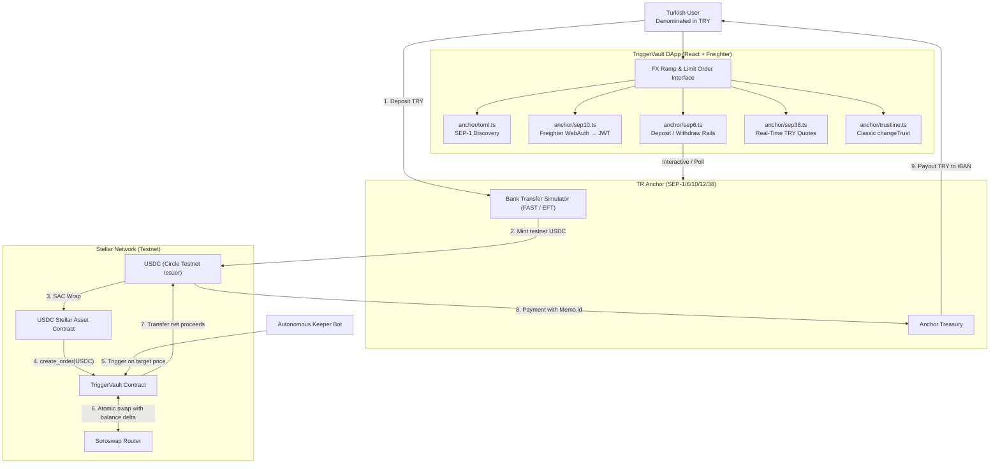

# TriggerVault ⚡

> **Autonomous FX Hedging & Non-Custodial Order Settlement on Stellar**
> Built for the Rise In × Stellar Pro Hackathon 2026.

**[▶ Live demo](https://trigger-vault-mu.vercel.app)** · [Vault contract on Stellar Expert](https://stellar.expert/explorer/testnet/contract/CDERIBD7XORORRYYOZDM44EOJIHJWZGEBE7WTAMHJMYGWI33UKGYQMPB) · Stellar Testnet

---

## The problem

A freelancer in Istanbul invoices in USD and spends in lira. To protect a rate they
have three bad options: watch the chart themselves, leave funds on a centralised
exchange that can freeze the account, or hand keys to a custodial bot.

TriggerVault gives them the fourth: a limit order that rests **on-chain**, priced in
lira, executed by anyone, with collateral that never leaves a Soroban contract. Money
enters and leaves through a Turkish bank transfer over SEP-6, so the user never has to
think in stablecoins.

---

## Live deployment

| | Address / URL |
| --- | --- |
| **dApp** | <https://trigger-vault-mu.vercel.app> |
| **Vault contract** | [`CDERIBD7…GYQMPB`](https://stellar.expert/explorer/testnet/contract/CDERIBD7XORORRYYOZDM44EOJIHJWZGEBE7WTAMHJMYGWI33UKGYQMPB) |
| **USDC SAC** (collateral) | [`CBIELTK6…HMXQDAMA`](https://stellar.expert/explorer/testnet/contract/CBIELTK6YBZJU5UP2WWQEUCYKLPU6AUNZ2BQ4WWFEIE3USCIHMXQDAMA) |
| **USDC issuer** | [`GBBD47IF…3ZLLFLA5`](https://stellar.expert/explorer/testnet/account/GBBD47IF6LWK7P7MDEVSCWR7DPUWV3NY3DTQEVFL4NAT4AQH3ZLLFLA5) |
| **Native XLM SAC** (target) | [`CDLZFC3S…U2HHGCYSC`](https://stellar.expert/explorer/testnet/contract/CDLZFC3SYJYDZT7K67VZ75HPJVIEUVNIXF47ZG2FB2RMQQVU2HHGCYSC) |
| **Soroswap router** | [`CCJUD55A…64UZZE7BRD`](https://stellar.expert/explorer/testnet/contract/CCJUD55AG6W5HAI5LRVNKAE5WDP5XGZBUDS5WNTIVDU7O264UZZE7BRD) |
| **TRY anchor** (sandbox) | <https://tr-mock-anchor.fly.dev> — SEP-1/6/10/12/38 |

> The anchor is a **sandbox** TRY anchor: the bank leg is simulated, the Stellar leg is a
> real testnet transaction. The client is written against the published SEPs and is
> portable to a production anchor by changing one home domain.

---

## Architecture



---

## Security model

The one design decision worth defending to a jury:

**The vault does not trust the router's return value.** `execute_order` reads the
contract's own `token_out` balance before and after the swap and uses the *observed
delta* as the realised output. If that delta is below `min_amount_out`, the whole
transaction reverts. A router that reports a good fill while delivering less, or one
that pays out without ever taking the input, both fail — and there is a regression test
for each (`test_slippage_uses_actual_received_balance_and_reverts_atomically`,
`test_rejects_router_that_does_not_take_the_input`).

Other properties:

- **Non-custodial.** Collateral sits in the vault under the order's owner. `cancel_order`
  refunds 100% and only the creator can call it.
- **Bounded bounty.** The keeper reward is computed from the observed delta and capped at
  1,000 bps (10%).
- **Scoped authorization.** The router's pull of the input is authorized through a scoped
  sub-invocation, not a blanket approval.
- **TTL managed.** Persistent entries target a ~120-day TTL, renewed under ~30 days.

Full detail: [`docs/ARCHITECTURE.md`](docs/ARCHITECTURE.md),
[`docs/SPECIFICATION.md`](docs/SPECIFICATION.md).

---

## Quickstart

```bash
git clone https://github.com/Nghtphl/trigger-vault.git && cd trigger-vault
```

**Frontend**

```bash
cd frontend && npm install && cp .env.example .env.local && npm run dev
```

Opens on <http://localhost:5173>. Requires [Freighter](https://freighter.app) set to
**Testnet**. Browsing the order queue needs no wallet; signing does.

**Contract**

```bash
cd contracts/vault
cargo test                                              # 11 tests
cargo build --release --target wasm32-unknown-unknown   # deployable wasm
```

**Keeper**

```bash
cd keeper && npm install && npm start
```

Deployment and invocation commands: [`docs/TESTNET_RUNBOOK.md`](docs/TESTNET_RUNBOOK.md).

### Environment

| Variable | Purpose |
| --- | --- |
| `VITE_VAULT_CONTRACT_ID` | Deployed TriggerVault contract |
| `VITE_RPC_URL` | Soroban RPC endpoint |
| `VITE_HORIZON_URL` | Horizon, for classic balances and trustlines |
| `VITE_ANCHOR_HOME_DOMAIN` | SEP-1 discovery root for the TRY anchor |
| `VITE_USDC_ISSUER` / `VITE_USDC_SAC_ID` | Collateral asset, classic and SAC sides |
| `VITE_TOKEN_OUT_CONTRACT_ID` | Default target asset |

All values ship in [`frontend/.env.example`](frontend/.env.example); nothing is hardcoded
past the anchor's home domain.

---

## Stellar Skills used

Cited by path, as the handbook requires.

| Skill file | Where it shows up |
| --- | --- |
| `SKILL.md` — [`CheesecakeLabs/stellar-anchor-skill`](https://github.com/CheesecakeLabs/stellar-anchor-skill) | The whole SEP-6/10/38 bridge in `frontend/src/anchor/` |
| `skills/standards/SKILL.md` — [`stellar/stellar-dev-skill`](https://github.com/stellar/stellar-dev-skill) | SEP-1 discovery (`toml.ts`), SEP-10 JWT (`sep10.ts`), SEP-38 quotes (`sep38.ts`) |
| `skills/assets/SKILL.md` | `changeTrust` trustline setup and the classic → SAC bridge (`trustline.ts`, `stellar.ts`) |
| `skills/dapp/SKILL.md` | Freighter connection, network guard and transaction signing (`frontend/src/App.tsx`) |
| `skills/smart-contracts/SKILL.md` | Soroban storage, TTL management and auth in `contracts/vault/src` |

Index: <https://skills.stellar.org/>

---

## Repository map

```
contracts/vault/   Soroban limit-order vault (Rust, no_std) + 11 tests
frontend/          React 19 + Vite dApp; anchor/ holds the SEP client
keeper/            Executor bot that settles orders when the rate is reachable
docs/              Architecture, spec, anchor integration, testnet runbook
```

---

## Roadmap — toward SCF / InstAward

TriggerVault is built to outlive the hackathon. The limit-order engine is the smallest
useful piece of a larger thesis: **Turkish users should be able to hold, hedge and exit
dollar exposure without touching a custodial exchange.**

### Q4 2026 — Submit and harden

- Submit to the **Stellar Community Fund** with the testnet deployment and this repo as
  the build record.
- Replace the sandbox anchor with a **production TRY anchor** (BiLira / TRYB is the
  first integration target — same SEP surface, so the client changes by one home domain).
- Move the keeper from manual trigger to a supervised always-on executor with
  retry, nonce management and alerting.
- Close the remaining testnet gaps: SEP-12 KYC fields and anchor-side fee disclosure.

### Q1 2027 — Audit and mainnet

- **Third-party security audit** of the vault contract, scoped to the balance-delta
  settlement path, authorization tree and TTL lifecycle.
- Mainnet deployment behind a conservative per-order cap, lifted on audit sign-off.
- Public keeper market: open bounty discovery so execution is not dependent on us.

### Q2 2027 — Distribution

- **Embedded limit-order SDK** — the vault's create/cancel/execute surface packaged for
  mobile wallets, so any Stellar wallet serving Turkish users can offer resting orders
  without shipping a contract.
- Pilot with one wallet or remittance partner reaching Turkish freelancers.
- Apply for **InstAward** continuation funding against measured usage: orders created,
  volume settled, and lira actually delivered to IBANs.

**Success metric, not vanity:** lira delivered to a bank account through an order the
user never had to watch.

---

## Documentation

| Document | Contents |
| --- | --- |
| [`docs/ARCHITECTURE.md`](docs/ARCHITECTURE.md) | System flow and storage model |
| [`docs/SPECIFICATION.md`](docs/SPECIFICATION.md) | Entrypoints, data structures, slippage and TTL semantics |
| [`docs/ANCHOR_INTEGRATION.md`](docs/ANCHOR_INTEGRATION.md) | SEP-1/6/10/12/38 integration in depth |
| [`docs/TESTNET_RUNBOOK.md`](docs/TESTNET_RUNBOOK.md) | Deploy, initialise and invoke on testnet |
| [`docs/PITCH_AND_DEFENSE.md`](docs/PITCH_AND_DEFENSE.md) | Problem framing and jury Q&A |
| [`docs/HACKATHON_READINESS.md`](docs/HACKATHON_READINESS.md) | Submission checklist |
| [`SECURITY.md`](SECURITY.md) | Disclosure policy |

---

## Licence & status

Stellar **Testnet** only. No mainnet value is at risk. Not audited — see the roadmap.
