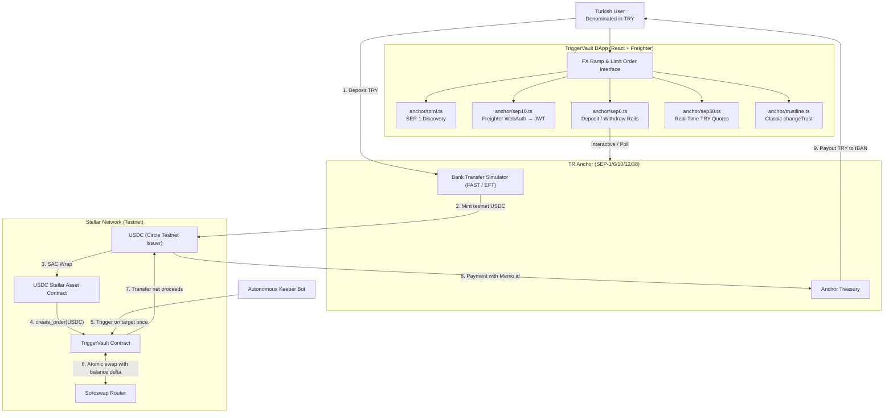

# TriggerVault ⚡

> **Autonomous FX Hedging & Non-Custodial Order Settlement on Stellar**\
> Built for the Rise In × Stellar Pro Hackathon 2026.

TriggerVault connects Turkish retail users and international freelancers to automated, non-custodial limit orders denominated directly in Turkish Lira (TRY). By bridging local payment rails with Soroswap AMM liquidity via SEP standards, TriggerVault allows users to deposit Lira via bank transfer, lock in automated exit conditions, and withdraw proceeds straight back to their IBAN.

---

## Architecture

