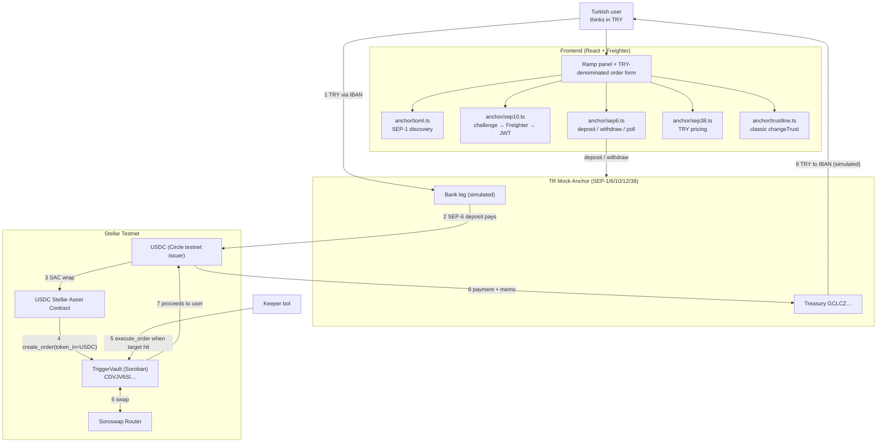

# Anchor Integration Spec — TriggerVault × TR Mock Anchor (TRY ⇄ USDC)

> **Purpose of this file.** This is an executable implementation spec. Hand it to a coding
> agent (Claude Code / Cursor) or work through it manually, top to bottom. Every section
> states the file to touch, the contract of the code, and the acceptance test.
>
> **Why it exists.** The Pro Hackathon 2026 handbook makes a fiat rail a *hard requirement*
> for both tracks: *"Anchor / Local Payments: give the product a real fiat rail using an
> anchor… a user should be able to put real Turkish lira in and get a usable balance out,
> or the reverse."* The judging rubric adds: *"Note: Anchor and local payment integrations
> carry the highest weight within this category."* TriggerVault currently has **no fiat
> rail at all**. This is the single highest-value gap in the submission.
>
> Facts below were verified against the live anchor on **2026-09-19**. Anything marked
> ⚠️ must be re-checked at runtime rather than trusted from this file.

---

## 0. Decision record — which anchor, and why

| Candidate | TRY support | Usable tonight? | Verdict |
| --- | --- | --- | --- |
| **TR Mock Anchor** — `tr-mock-anchor.fly.dev` | **Yes**, native TRY ⇄ USDC | **Yes.** Live sandbox, no signup, no API key, no allowlist. Stellar leg pays **real testnet USDC** | ✅ **Chosen** |
| Stellar test anchor — `testanchor.stellar.org` | No (SRT asset, USD-ish) | Yes | ❌ No TRY story — fails the "Turkish lira in / out" wording |
| MoneyGram Access (test) | No (cash-out USD corridors) | No — partner allowlist required | ❌ Out of scope for a 2-day window |
| Self-hosted SDF Anchor Platform | You define it | No — hours of infra, plus a bank simulator you'd write yourself | ❌ Wrong use of the remaining time |
| BlindPay / Bridge (handbook on/off-ramp partners) | No TRY corridor | Needs commercial onboarding | ❌ Not reachable in-event |

**Chosen: TR Mock Anchor.** Reasons, in order of weight:

1. **It is the TRY rail this event is built around.** The handbook schedules an *Anchor
   Integration* workshop about "how anchor works as a TRY anchor"; this anchor is published
   by `kaankacar`, the same ecosystem author the handbook links under Privacy Resources, and
   other teams at this event are already building against it.
2. **Standards-pure, therefore portable.** It implements **SEP-1, SEP-10, SEP-6, SEP-12,
   SEP-38**. The client you write is not "mock client" code — point the same code at a real
   anchor by changing *two values*: the network and the home domain. Say this out loud to the
   jury; it converts "you used a mock" into "we built the portable integration".
3. **The Stellar leg is real.** The bank/KYC/payout legs are simulated; the deposit pays
   genuine testnet USDC (Circle testnet issuer) to the user's account, and the withdrawal
   watches a genuine on-chain payment. That is exactly the line the rubric draws with
   *"real functionality — not mocked or hardcoded"*: your protocol's leg is real.
4. **Zero onboarding friction.** No API keys, no signup — the user's Stellar key is the
   identity. A judge can run the whole flow on a demo laptop in two minutes.

**Honesty rule for the pitch and the README:** call it what it is — *"a sandbox TRY anchor;
the bank leg is simulated, the Stellar leg is real, and the same SEP-6 client works against a
production anchor"*. Do not imply real lira moved. Overclaiming is the fastest way to lose the
Technical Implementation score.

---

## 1. What the integration changes about the product

**Today:** TriggerVault is crypto-in / crypto-out. A user must already hold XLM, and the
lira never appears anywhere. That fails requirement #2 outright.

**After this spec:** TriggerVault becomes *"lira-denominated automated exit for Turkish
users"* — and the anchor is **load-bearing**, not a button in a corner:

```
TRY (bank/IBAN)
   └─ SEP-6 deposit ──► USDC on Stellar (real testnet USDC, user's own account)
        └─ SAC wrap ──► create_order(token_in = USDC)   ← collateral is now anchor-sourced
             └─ keeper + Soroswap ──► order executes at the user's target price
                  └─ SEP-6 withdraw ──► TRY back to the user's IBAN
```

The product sentence becomes: **"1 XLM 7,50 TL olduğunda sat, parayı IBAN'ıma gönder."**
The user thinks in lira, the rails are Stellar, the automation is your Soroban contract.
That single sentence covers requirement #1 (integration), #2 (anchor), and #3 (core
feature: the order's collateral *comes from* the anchor and the proceeds *return through*
it — remove the anchor and the product stops being what it claims).

---

## 2. Anchor facts (verified 2026-09-19)

| Key | Value |
| --- | --- |
| Home domain | `tr-mock-anchor.fly.dev` |
| TOML | `https://tr-mock-anchor.fly.dev/.well-known/stellar.toml` |
| Network | Stellar **Testnet** (`Test SDF Network ; September 2015`) |
| `WEB_AUTH_ENDPOINT` (SEP-10) | `https://tr-mock-anchor.fly.dev/auth` |
| `TRANSFER_SERVER` (SEP-6) | `https://tr-mock-anchor.fly.dev/sep6` |
| `KYC_SERVER` (SEP-12) | `https://tr-mock-anchor.fly.dev/sep12` |
| `ANCHOR_QUOTE_SERVER` (SEP-38) | `https://tr-mock-anchor.fly.dev/sep38` |
| `SIGNING_KEY` (validates SEP-10 challenge) | `GDXYO6FJCNXZEWGXD54GT76FGFYLOLSOGSOJLNQ6WGHCGEQPO7NTE73M` |
| Treasury (withdraw destination) | `GCLCZEQZ2THTEDAOFI66LACNPLY4OBKN7VKLEZFMBIHYKYQOW2W7T3Z6` |
| Asset | `USDC` |
| Issuer | `GBBD47IF6LWK7P7MDEVSCWR7DPUWV3NY3DTQEVFL4NAT4AQH3ZLLFLA5` (Circle testnet USDC) |
| Rate source | Reflector USD/TRY oracle + ~50 bps spread |
| Deposit limits ⚠️ | ~50.00 – 3000.00 TRY |
| Min off-ramp ⚠️ | 1.0000000 USDC |
| Docs | `/guide`, `/sep`, `/explorer`, `/llms.txt`, `/llms-full.txt` |

**⚠️ Hardcode nothing except the home domain.** Read the TOML at startup and derive every
endpoint, the issuer and the signing key from it; read `GET /sep6/info` for asset limits,
fee structure and the accepted `type` / `funding_method` values. This is not pedantry — it
is the thing that makes the "portable to a real anchor" claim true, and the jury will ask.

---

## 3. Target architecture



Keep this diagram in `docs/ARCHITECTURE.md` too — the Scale Track submission explicitly
requires *"an accurate Mermaid architecture diagram"*.

---

## 4. Implementation plan

Priority order is deliberate: **P0 gets you compliant**, P1 makes it a product, P2 is polish.
If you run out of night, stop after P0 and demo that.

### P0-1 — Config and environment

Create `frontend/.env.example` (and a real `.env.local`), and document every var in the README:

```dotenv
# Existing
VITE_VAULT_CONTRACT_ID=CDVJV6SITYH2A4CNTG4YG5CDYDRM5ABTDIBA3UVBLXFQNE6FWK3BNTWD
VITE_RPC_URL=https://soroban-testnet.stellar.org

# Anchor (SEP-1 discovery does the rest)
VITE_ANCHOR_HOME_DOMAIN=tr-mock-anchor.fly.dev
VITE_HORIZON_URL=https://horizon-testnet.stellar.org

# USDC as used by the vault. ISSUER is a fallback only — prefer the TOML value.
VITE_USDC_ISSUER=GBBD47IF6LWK7P7MDEVSCWR7DPUWV3NY3DTQEVFL4NAT4AQH3ZLLFLA5
VITE_USDC_SAC_ID=            # fill from the CLI command in P0-6
VITE_TOKEN_OUT_CONTRACT_ID=  # XLM SAC or the asset you swap into
```

### P0-2 — `frontend/src/anchor/toml.ts` (SEP-1)

```ts
export interface AnchorConfig {
  homeDomain: string;
  webAuth: string;        // WEB_AUTH_ENDPOINT
  transferServer: string; // TRANSFER_SERVER
  kycServer: string;      // KYC_SERVER
  quoteServer: string;    // ANCHOR_QUOTE_SERVER
  signingKey: string;     // SIGNING_KEY — used to validate the SEP-10 challenge
  asset: { code: string; issuer: string };
}

export async function loadAnchorConfig(homeDomain: string): Promise<AnchorConfig>;
```

Fetch `https://${homeDomain}/.well-known/stellar.toml`, parse it (a ~30-line regex/INI
parser is fine — do **not** add a TOML dependency for this), and fail loudly if
`NETWORK_PASSPHRASE` does not match `Networks.TESTNET`. Cache the result in module state.

### P0-3 — `frontend/src/anchor/sep10.ts` (authentication)

```ts
export async function authenticate(cfg: AnchorConfig, account: string): Promise<string>; // returns JWT
```

Flow:

1. `GET ${cfg.webAuth}?account=${account}` → `{ transaction, network_passphrase }`.
2. **Validate before signing** — this is a security requirement, not a nicety:
   rebuild with `TransactionBuilder.fromXDR(transaction, network_passphrase)`, then assert
   the source account equals `cfg.signingKey`, the sequence number is `0`, and the first
   operation is a `manageData` whose key is `"<home domain> auth"`. Refuse to sign otherwise.
3. Sign with Freighter: `signTransaction(xdr, { networkPassphrase, address: account })`.
4. `POST ${cfg.webAuth}` with `{"transaction": signedXdr}` → `{ token }`.
5. Keep the JWT **in memory** (or `sessionStorage`), never `localStorage`; refresh on 401.

### P0-4 — `frontend/src/anchor/trustline.ts` (classic asset, required before deposit)

The anchor pays **classic USDC**. A Stellar account cannot receive it without a trustline,
so the deposit silently dead-ends without this step. Build a classic transaction with
Horizon (`Horizon.Server` in `@stellar/stellar-sdk` v12), sign via Freighter, submit:

```ts
export async function ensureTrustline(cfg: AnchorConfig, account: string): Promise<boolean>;
// loadAccount → if no balance line for (code, issuer):
//   Operation.changeTrust({ asset: new Asset(code, issuer) })  → sign → submit
```

Surface it in the UI as a one-click **"Enable USDC"** step with a plain-language
explanation. Judges score "intuitive even for someone new to crypto" — this is one of the
few moments where crypto leaks into the UX, so handle it gracefully.

### P0-5 — `frontend/src/anchor/sep6.ts` (the rail itself)

```ts
export async function anchorInfo(cfg, jwt): Promise<Sep6Info>;            // GET /info
export async function startDeposit(cfg, jwt, p: {account: string; amount?: string}): Promise<DepositInstructions>;
export async function simulateBankTransfer(cfg, jwt, id: string, amount: string): Promise<void>; // sandbox only
export async function startWithdraw(cfg, jwt, p: {amount: string; dest?: string}): Promise<WithdrawInstructions>;
export async function getTransaction(cfg, jwt, id: string): Promise<Sep6Transaction>;
export function pollTransaction(cfg, jwt, id: string, onUpdate: (t: Sep6Transaction) => void): () => void;
```

Wire contract, as observed on the live anchor (⚠️ confirm parameter names against
`GET /sep6/info` at runtime — this anchor accepts the modern `funding_method`, and older
SEP-6 clients send `type`; **send both** for safety):

**Deposit (on-ramp, TRY → USDC)**

```
GET  {transferServer}/deposit?asset_code=USDC&account={G…}&funding_method=bank_account&type=bank_account&amount=500
     Authorization: Bearer {jwt}
  → { id, how / instructions: { … IBAN …, external_transfer_memo / reference … } }

POST {transferServer}/tx/{id}/simulate-bank-transfer     ← sandbox only; "the TRY arrives when you say so"
     {"amount":"500.00"}

GET  {transferServer}/transaction?id={id}
  → { transaction: { status, amount_in, amount_out, stellar_transaction_id, … } }
```

Status ladder to render: `incomplete → pending_user_transfer_start → pending_anchor →
completed` (treat `error` / `expired` as terminal). Poll every ~3 s with a hard stop; show
the ladder as a stepper in the UI — it is the most convincing thing on screen during a demo,
because each step is a real state transition, not an animation.

**Withdraw (off-ramp, USDC → TRY)**

```
GET  {transferServer}/withdraw?asset_code=USDC&funding_method=bank_account&type=bank_account&amount=5[&dest={IBAN}]
     Authorization: Bearer {jwt}
  → { id, account_id: "GCLCZ…" (treasury), memo, memo_type: "id" }
```

Then the user sends the USDC themselves — a **classic payment with the memo attached**:

```ts
new TransactionBuilder(account, { fee: BASE_FEE, networkPassphrase: Networks.TESTNET })
  .addOperation(Operation.payment({
      destination: account_id,
      asset: new Asset(cfg.asset.code, cfg.asset.issuer),
      amount,                       // 7-decimal string
  }))
  .addMemo(Memo.id(memo))           // memo_type is "id" → Memo.id, NOT Memo.text
  .setTimeout(120)
  .build();
```

**The memo is how the anchor identifies the withdrawal — a payment without it is lost.**
Put that warning in the code as a comment and in the UI as a disabled-until-ready state.
Then poll `/transaction?id=` until `completed` and show `external_transaction_id` as the
"bank reference".

### P0-6 — Make USDC the vault's collateral

The vault speaks Soroban token addresses, the anchor speaks classic assets. The Stellar
Asset Contract is the bridge. Get (and if necessary deploy) the SAC id:

```bash
# Deterministic SAC id for the anchor's USDC
stellar contract id asset \
  --asset USDC:GBBD47IF6LWK7P7MDEVSCWR7DPUWV3NY3DTQEVFL4NAT4AQH3ZLLFLA5 \
  --network testnet

# If it has never been deployed on testnet, deploy it once (idempotent afterwards):
stellar contract asset deploy \
  --asset USDC:GBBD47IF6LWK7P7MDEVSCWR7DPUWV3NY3DTQEVFL4NAT4AQH3ZLLFLA5 \
  --network testnet --source <your-key>
```

Put the result in `VITE_USDC_SAC_ID`, then in `frontend/src/App.tsx`:

* stop hardcoding `token_in` to `NATIVE_XLM_SAC` — let the user pick, defaulting to the
  **USDC SAC** now that collateral arrives from the anchor;
* keep amounts in 7-decimal stroop math for both assets (`toStroops` already does this);
* the vault holds SAC balances as a contract address — **no trustline needed for the
  contract**; the *user's* account needs one (P0-4), because that is where proceeds land.

No contract change is required for this: `create_order` is already token-generic.

### P0-7 — UI integration (where the anchor lives on screen)

Add a **"Fund your vault"** panel as the first step of the order form, not a separate page:

* balance row: `USDC (anchor) · XLM` with a **Deposit TRY** button;
* deposit dialog: amount in **TRY**, live SEP-38 conversion preview, IBAN + reference
  instructions, the "I sent it" button (which calls `simulate-bank-transfer` in sandbox),
  then the status stepper;
* after `completed`, the USDC balance updates and the order form unlocks;
* on an executed order, show **"Withdraw to IBAN"**, which runs the P0-5 withdraw flow.

### P1-1 — TRY-denominated orders (`frontend/src/anchor/sep38.ts`)

This is what makes the anchor *load-bearing* rather than decorative. Let the user express
the trigger in lira:

```
GET  {quoteServer}/price?sell_asset=iso4217:TRY&buy_asset=stellar:USDC:{issuer}&sell_amount=1000&context=sep6
POST {quoteServer}/quote        (Bearer jwt)  → { id, price, expires_at }
```

* show "Target: 1 XLM = **7.50 TL**" in the form, convert to `min_amount_out` on chain;
* display every order in the table with both its on-chain limit and its TRY equivalent;
* label the rate source honestly ("Reflector USD/TRY + anchor spread, quoted at {time}").

If you use `quote_id`, switch to the `/deposit-exchange` and `/withdraw-exchange`
endpoints, which take a `quote_id` and lock the rate.

### P1-2 — Keeper: close the loop

In `keeper/src/index.ts`, after a successful `execute_order`, optionally auto-start the
off-ramp for opted-in orders: SEP-10 with the keeper's own key, `POST /sep6/withdraw`, and
notify the user that a withdrawal is waiting for their signature. Do **not** attempt to
send the memo payment from the contract — SAC transfers carry no memo, so the user's
signature is what makes the withdrawal identifiable. Document this trade-off in the README;
it is exactly the kind of "design decision and trade-off" the rubric asks for.

### P2 — SEP-12 and the honest-limits touches

* `POST {kycServer}/customer` with `account` + a couple of fields; the anchor auto-accepts
  and stores nothing. Rendering a one-screen KYC step shows the jury you understand where a
  real anchor would gate the flow.
* Enforce the anchor's own limits client-side (50–3000 TRY deposit, ≥1 USDC withdraw) with
  clear messages rather than letting the API reject.

---

## 5. Acceptance criteria — the demo the jury runs

The integration is done when a fresh Freighter account can, unaided:

1. Connect the wallet and enable USDC (one click).
2. Enter **500 TRY**, see the USDC preview, receive IBAN + reference.
3. Confirm the (simulated) transfer and watch the status reach `completed` — with a real
   `stellar_transaction_id` link to stellar.expert.
4. See the USDC balance appear in the app.
5. Create a trigger order **denominated in TRY** whose collateral is that USDC, and see the
   `create_order` transaction hash on the ledger.
6. Have the keeper execute it (or cancel it) — again with a real hash.
7. Click **Withdraw to IBAN**, sign the memo payment, and watch the anchor reach
   `completed` with a bank reference.

Record this run as a screen capture and keep the transaction hashes — the Traction and
Presentation criteria both reward evidence over claims.

---

## 6. Pitfalls that will cost you the demo

| Pitfall | Consequence | Guard |
| --- | --- | --- |
| **CORS** on browser→anchor calls | Deposit silently fails in the browser only | Test one `fetch` from the app's origin **first**; if blocked, proxy the anchor calls through the keeper (add a tiny Express route) rather than rewriting the UI at 4 a.m. |
| Missing trustline | Deposit "completes" but no USDC arrives | P0-4 before any deposit; block the button otherwise |
| Missing/incorrect memo on withdraw | Funds sit at the treasury, unmatched | `Memo.id(memo)` when `memo_type === "id"`; never send without it |
| JWT expiry mid-flow | 401 in the middle of a poll | Re-authenticate transparently and retry once |
| Decimals | 10× or 0.1× amounts on screen | Stellar classic and SAC both use 7 decimals; keep stroop integers end-to-end, format only at the edge |
| Hardcoding endpoints | Kills the "portable to a real anchor" pitch | Everything from the TOML + `/sep6/info` |
| Anchor sandbox resets | Balances/txs disappear mid-demo | Re-run the deposit before presenting; keep the tx hashes and a recorded video as backup |
| Calling it a real anchor | Credibility hit with the jury | Say "sandbox TRY anchor, real Stellar leg, portable client" |

---

## 7. Submission requirements this spec feeds

* **Skills citation (mandatory).** The handbook requires teams to *"cite which specific
  skill file(s) (by path, e.g. `skills/standards/SKILL.md`) they used during development"*.
  For this work the relevant ones are the official **Anchors** skill
  (`SKILL.md` in `CheesecakeLabs/stellar-anchor-skill`, linked from skills.stellar.org) and,
  from `stellar/stellar-dev-skill`: `skills/standards/SKILL.md` (SEPs), `skills/assets/SKILL.md`
  (trustlines and the SAC bridge), `skills/dapp/SKILL.md` (Freighter/signing) and
  `skills/smart-contracts/SKILL.md`. Add a **"Stellar Skills used"** section to the root
  README listing the paths you actually consulted.
* **Mermaid architecture diagram** — reuse §3 in `docs/ARCHITECTURE.md`.
* **README** — document the anchor flow, the contract IDs, the env vars, the live demo URL
  and a setup/test walkthrough.

---

## 8. References

* TR Mock Anchor — <https://tr-mock-anchor.fly.dev> (`/guide`, `/sep`, `/explorer`, `/llms.txt`)
* TR Mock Anchor source — <https://github.com/kaankacar/tr-mock-anchor>
* Stellar anchors overview — <https://developers.stellar.org/docs/learn/fundamentals/anchors>
* SEP-6 (programmatic deposit/withdrawal), SEP-10 (web auth), SEP-12 (KYC), SEP-38 (quotes) —
  <https://github.com/stellar/stellar-protocol/tree/master/ecosystem>
* Stellar Skills — <https://skills.stellar.org/> · Anchors skill —
  <https://github.com/CheesecakeLabs/stellar-anchor-skill>
* Freighter API — <https://docs.freighter.app/docs/guide/introduction>
