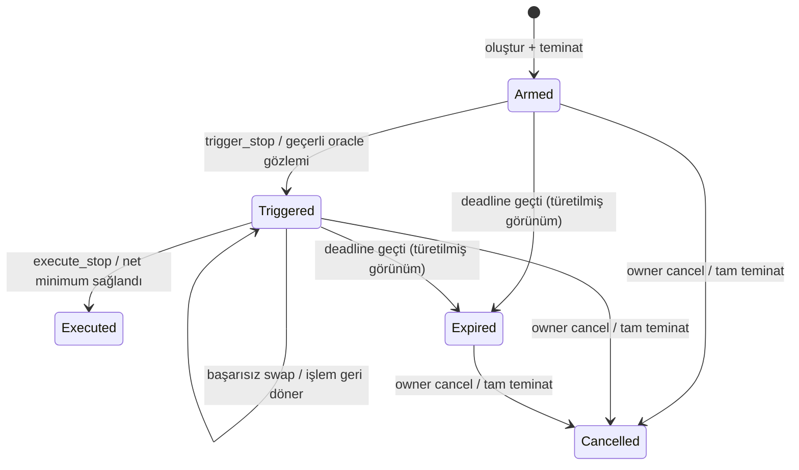

# LumaFlow — Stop-loss ve gizlilik tasarımı

**Durum:** Tasarım önerisi; uygulanmış, denetlenmiş veya deploy edilmiş özellik beyanı değildir.
**Tarih:** 20 Eylül 2026. **Kapsam:** Testnet; XLM → USDC stop-satış.
**Amaç:** Çalışan limit-emir ürününü koruyarak gerçek stop tetiklemesi eklemek, ardından sınırlı ve dürüst bir gizlilik katmanı kurmak.

Bu doküman, “Stop-loss planı — commit–reveal + oracle kapısı” taslağının geliştirilmiş halidir. Taslakta doğru olan oracle kapısı ve bakiye-farkı settlement yaklaşımını korur; atomik geri dönüş, erken execution, sır kaybı, oracle birimleri ve gizlilik iddialarındaki açıkları kapatır. Buradaki tercihler yeni uygulama için öneridir; mevcut V2'nin davranışını değiştirmez.

## 1. Kullanıcıya verdiğimiz söz

Kullanıcı satış kararını önceden tanımlar. Sistem onun yerine daha kötü şartları kabul etmez. Üç ayrı sorumluluk vardır:

1. **Tetik:** Fiyat düşüşü satış yetkisini etkinleştirir.
2. **Settlement:** Kullanıcının net minimumu sağlanmadan satış tamamlanmaz.
3. **Gizlilik:** Emir bilgisine kimlerin, ne zaman erişebildiğini sınırlandırmayı amaçlar; ilk ikisinin yerine geçmez.

Ürün adı **“Stop-loss — minimum tutarlı satış (stop-limit)”** olmalıdır. Minimum net ödeme varken, her koşulda satış veya azami zarar garantisi verilemez. Fiyat boşluğunda emir tetiklenmiş olsa da gerçekleşmeyebilir. Oracle ve keeper kesintileri bu riski artırır.

“Non-custodial” ifadesi, özel anahtarın bizde olmamasıyla bitmez: sözleşme yetkileri, router ve oracle bağımlılıkları, token issuer yetkileri ve çıkış yolu birlikte açıklanır. Değişmez vault, dış bağımlılıkların da değişmez olduğu anlamına gelmez.

**İlke:** Güvenlik sınırlarını azaltarak başarı oranını artırma. Satılamayan emri açıkça göster; kullanıcının minimumunu sessizce düşürme. Gizliliği veya otomasyonu varmış gibi göstererek güven üretme.

## 2. Başlangıç durumu ve korunacaklar

Yerel kaynak incelemesinde V2, `min_user_out` tabanlı limit emirleri içeriyor. Oracle stop kapısı ve commit–reveal mevcut uygulama olarak bulunmadı. Frontend'de Reflector fiyatı bulunması kontratta stop koşulu olduğu anlamına gelmez. Uygulama öncesi diğer çalışma kopyası, branch ve deploy bilgileriyle bu başlangıç tekrar eşleştirilmelidir.

Bilinen aktif V2 adresi: `CAVF2IT2KTOES576A2WNIIQVIBNHWVGMSIRE55XFJGB6WD3R4HWP2INT`.
USDC SAC: `CBIELTK6YBZJU5UP2WWQEUCYKLPU6AUNZ2BQ4WWFEIE3USCIHMXQDAMA`.
XLM SAC: `CDLZFC3SYJYDZT7K67VZ75HPJVIEUVNIXF47ZG2FB2RMQQVU2HHGCYSC`.
Bu adresler başlangıç referansıdır; yeni test/deploy öncesi ağ ve zincirdeki kod doğrulanır.

- V2 limit oluşturma, execution, iptal, net minimum, imza akışı ve anchor işlevleri korunur.
- V0/V1/V2 emirleri otomatik iptal edilmez, taşınmaz, yeniden yorumlanmaz veya çalıştırılmaz.
- Yeni stop kontratı **V3** olarak ayrı deploy edilir. Upgrade girişi eklenmez.
- İlk V3 yalnız stop-satış destekleyebilir; V2 limit ürününü gereksiz yere yeniden yazmak zorunda değildir.
- V2 limit oluşturmanın açık kalması ile V0/V1 emekli politikası ayrı yönetilir. “En yeni kontrat tüm emirleri kabul eder” varsayımı kullanılmaz.
- Registry ayrı `version`, `payoutSemantics`, `capabilities`, `acceptingOrderTypes` taşır. `gross/net` ödeme semantiğine üçüncü değer olarak “stop” eklenmez.
- React key, önbellek, keeper işi ve işlem raporu kimliği `(network, vaultId, orderId)` olur.
- V3'te sorun çıkarsa yeni stop oluşturma kapatılır; mevcut stopların okuma/iptal erişimi korunur. Frontend rollback zincirdeki yeni emirleri yok etmez.

## 3. Tehdit modeli

| Aktör / olay | Yapabildiği zarar | Sınır ve kalan risk |
| --- | --- | --- |
| Kötü niyetli executor | Erken yürütme, farklı alıcı, tekrar ödeme denemesi | Kontrat tür/durum/oracle/owner/minimum kontrolleri; kanıtlı şartlar dışında ödeme yok |
| Keeper kesintisi | Tetik fırsatını veya dolumu kaçırma | İzleme, yedek keeper, kullanıcı uyarısı; execution garantisi yok |
| Oracle arızası/manipülasyonu | Yanlış tetik veya tetik yokluğu | Sabit politika, tazelik ve değer kontrolleri; kaynak doğruluğuna bağımlılık devam eder |
| Router / likidite sorunu | Kötü dolum, fon çekme denemesi | Sınırlı auth, izinli token/rota, giriş ve çıkış delta kontrolleri, net minimum |
| Frontend/RPC ele geçirilmesi | Yanlış imza önerisi, veri saklama, sırrı öğrenme | Kontrat değişmez şartları uygular; imza özeti, bağımsız explorer; XSS gizliliği yine bozabilir |
| Token issuer müdahalesi | Trustline yetkisi/limit sorunları, transfer engeli | İmza öncesi kontrol; başarısız ödemede atomik dönüş; koşulsuz iade vaadi yok |
| Admin / dış bağımlılık yükseltmesi | Router/oracle davranış değişikliği | V3'te sabit konfigürasyon tercihi; dış kontratların yönetişimi ayrıca kaydedilir |
| Salt kaybı / sızıntısı | Gizli stop çalışmaz veya gizliliğini kaybeder | Yedek, teslim teyidi, güvenilir durum mesajı; fon kurtarma sırrı gerektirmez |
| Ağ kesintisi / TTL / sansür | İşlemlerin gecikmesi, state erişim sorunu | Bakım ve restore prosedürü; ağdan bağımsız “her zaman iptal” garantisi yok |

## 4. Stop semantiği: kararlar

### 4.1 İki bağımsız fiyat sınırı

`stop_price`, tetik için oracle fiyatıdır. `min_user_out`, gerçekleşen satışın USDC cinsinden net tabanıdır. İkisi birbirinin yerine kullanılmaz.

Örnek (tasarım örneği, canlı kotasyon değil): 10 XLM, stop 0.10 USDC/XLM, net minimum 0.95 USDC, bounty %1. Oracle 0.10 veya altına inince tetiklenebilir. Brüt çıktı 0.96 USDC ise net 0.9504 ve satış geçer; brüt 0.94 ise net 0.9306 ve satış reddedilir. Reddedilen satış zarar tabanını düşürmez.

Emir oluştururken piyasa zaten stop seviyesinin altındaysa normal akış bunu reddeder; kullanıcı güncel koşulları yeniden değerlendirir. İlk sürümde gizli bir “hemen tetikle” seçeneği yoktur. Kontrol tek veri noktasıyla aşağı yönlü bir geçişin tamamını kanıtlamaz: ürün ifadesi “uygun oracle gözlemi eşikte/altında” olmalıdır.

### 4.2 Kalıcı tetik önerisi

Önerilen varsayılan **kalıcı tetik**tir: geçerli düşüş gözlemi zincirde bir kez kaydedildikten sonra emir `Triggered` olur. Fiyat sonra yükselse de kullanıcı iptal etmedikçe, süre dolmadıkça ve net taban sağlandıkça satılabilir. Bunun kullanıcıya imza öncesi gösterilmesi şarttır.



- `trigger_stop` yalnız durum ve oracle kanıtı kaydeder; swap/fon aktarımı yapmaz. Trigger başarısı “satıldı” diye gösterilmez.
- `execute_stop` yalnız `Triggered` emir üzerinde çalışır. İlk sürümde ayrı iki işlem kullanılır: tetik işlemi onaylanır, sonra swap denenir.
- Birleştirilmiş tetik+swap çağrısı başarısız olursa tetik kaydı da geri döner. Bu nedenle bu optimizasyon ilk sürümde yoktur.
- Kalıcı tetikten sonra yeniden `price <= stop` koşulu aranmaz. Execution için taze/geçerli oracle sağlık kontrolü uygulanır; bu, fiyatın tekrar yükselmiş olmasını reddetmez. Oracle kesilirse execution bekler, owner cancel yolu oracle çağırmaz.
- Geçmişte olmuş ama hiçbir geçerli işlemle kaydedilmemiş düşüş otomatik tetiklenmiş sayılmaz. İlk sürüm keyfî eski oracle örnekleriyle geriye dönük tetik kabul etmez.
- `Expired` ilk sürümde zamandan türetilir; süre dolması kendi başına iade işlemi başlatmaz. Kullanıcı iptal/iade işlemi gönderir.

Bu tercih ek bir işlem ve keeper maliyeti getirir. Kabul edilemiyorsa alternatif “yalnız execution anında eşik altında” modu ayrı ürün kararıdır; aynı isim altında sessizce değiştirilmez.

### 4.3 Limit ile stop aynı escrow'da mı?

İlk yayın **bağımsız stop emri**dir. Bir stop emri normal `execute_order` yolundan yürütülemez. Emir türü hem dış entrypoint'te hem ortak settlement önkoşulunda kontrol edilir.

Orijinal taslaktaki “normal take-profit + stop aynı emirde” fikri **OCO/bracket** özelliğidir; unutulmuş değil, ayrı aşamadır. Eklenirse tek teminat, ayrı `take_profit_min_user_out` ve `stop_min_user_out`, ayrı kapılar ve tek terminal durum gerekir. Stop tetiklenmesi take-profit kolunu devre dışı bırakır; aksi yarış politikasına ihtiyaç varsa ayrıca şartname yazılır. İlk başarılı kapanış diğer kolu kapatır. Aynı teminatı iki emir gibi saymak veya stop'un düşük tabanıyla normal yoldan hemen satmak yasaktır.

## 5. Oracle: koddan önce doğrulama kapısı

Bu aşama tamamlanmadan stop kontratı production'a sunulmaz. Bu doküman Reflector testnet feed'ini canlı doğrulamış değildir.

Kaydedilecek kanıtlar: ağ/passphrase, oracle adresi ve WASM hash'i, provider kaynağı, `base`, `assets`, `decimals`, `resolution`, seçilen asset kimliği, `lastprice` örnekleri ve ledger zamanları. Testnet feed'in hangi piyasalardan veri aldığı da açıklanır; testnet AMM fiyatıyla aynı olması beklenmez.

Önerilen tetik birimi **USDC/XLM**:

1. Güvenilir doğrudan XLM/USDC feed varsa onu kullan.
2. Yoksa doğrulanmış XLM/USD ve USDC/USD verilerinden çapraz kur hesapla; iki zaman damgasını ve izinli farklarını kontrol et.
3. USDC/USD yoksa sessizce 1 kabul etme. Ya kapıda dur ya da ürün şartnamesini açıkça “USD tetik, USDC ödeme” olarak değiştirip depeg riskini kullanıcıya bildir. Bu değişiklik belgelenmeden ilerleme.

`OraclePolicy` önerisi: kaynak(lar), asset kimlikleri, baz ve ölçekler, fiyat modu, `max_age_secs`, `max_timestamp_skew_secs`, `max_future_skew_secs`, politika sürümü/hash'i. İlk sürümde gelecek toleransı 0; daha fazlası gerekirse ölçülmüş gerekçe ve test gerekir.

Her kullanımda:

- Fiyat mevcut, pozitif, izinli aralıkta ve doğru asset/baz için olmalı.
- `timestamp <= ledger_time + future_tolerance`; çıkarma unsigned taşma yapmamalı.
- Yaş sınırı gözlenen yayın periyodu ve gecikmeye göre seçilmeli; keyfî sabit yazılmamalı.
- Çapraz feed'lerde iki veri de taze ve birbiriyle zaman açısından uyumlu olmalı.
- Şema/decimals beklenen politikayla uyuşmazsa reddet. Hatalı feed yerine frontend sabitiyle devam etme.
- Dış çağrı panikleri/None/geçersiz dönüşler kontrollü hata veya güvenli revert üretmeli.

**TWAP:** Varlığı ve semantiği doğrulanmadan var kabul edilmez. Kullanılırsa pencere, örnek sayısı, kapsama, boşluk ve zaman ağırlıkları tanımlanır. TWAP manipülasyonu/wick etkisini azaltabilir, tamamen ortadan kaldırmaz; düşüşe tepkiyi geciktirir. Spot/TWAP politikası emrin ömründe sessizce değiştirilmez. Basit doğrulanmış spot sürümü yayımlanabilir, ancak “wick korumalı” diye pazarlanamaz.

Sabit vault adresleri, oracle/router'ın kendi yükseltme yetkisini ortadan kaldırmaz. Bağımlılıkların yönetim modelini ve değişiklik izlemeyi risk envanterine ekle.

## 6. Kontrat veri modeli ve yetkiler

Şematik model; gerçek Rust/XDR türleri uygulama öncesi kesinleştirilir:

```text
StopOrder {
  id, owner, token_in, token_out, amount_in,
  min_user_out, fee_bps, deadline,
  trigger_spec, policy_id,
  status: Armed | Triggered | Executed | Cancelled,
  triggered_at?, observed_price?, observed_timestamp?
}
TriggerSpec = PublicStopBelow { stop_price }
// SealedStopBelow ileride ayrı sürüm/yayın kapısı; boş Option alanlarıyla yayına alma.
```

- XLM/USDC ve doğrulanmış SAC'lar allowlist ile sınırlandırılır. Aynı token çifti reddedilir. Genel token desteği ima edilmez.
- V3'te router/oracle/politika deploy anında sabitlenir; initialization yetkisiz ilk çağrıya açık bırakılmaz. Constructor veya doğrulanmış atomik initialize yöntemi seçilir.
- `set_router`, `set_oracle`, fon süpürme veya emergency-withdraw admin yetkisi ilk V3'e eklenmez. Dış bağımlılıklar ve iptal transferi riski yine vardır.
- Var olan emrin alıcısı, minimumu, ücreti, policy veya tokenları admin/keeper tarafından değiştirilemez.
- İlk sürümde düzenleme cancel + yeni create ile olur; aradaki korumasız süre ve ek ağ ücreti gösterilir.
- `create_stop_order`: owner auth → tüm yapısal/ekonomik/oracle/deadline kontrolleri → teminat transferi → state/event. Başarısız kontrolde escrow alınmaz.
- `trigger_stop`: executor auth, tür/durum/deadline, oracle ve eşik kontrolü; politika ve gözlem event'i. Permissionless olmak rastgele alıcı seçme yetkisi vermez.
- `execute_stop`: executor auth, tür/durum/deadline, oracle sağlık kontrolü, sabit rota, settlement.
- `cancel_order`: owner auth; Armed/Triggered/süresi geçmiş kapanmamış emir; oracle/keeper/salt gerektirmeden tam giriş miktarı owner'a iade.
- Deadline kontrolü `now >= deadline` iken trigger ve execution'ı engeller; iptal açık kalır. Router timeout, kullanıcı deadline'ından ayrı bir kavramdır.
- Terminal durumdan tekrar ödeme yok. State güncellemesi ile dış çağrı sırası test edilir; “platform reentrancy-safe” cümlesi durum yarışları ve scoped auth testlerinin yerine geçmez.
- Instance, WASM ve persistent kayıtların TTL/restore planı yazılır. Simülasyon bir bakım işlemi değildir. Bakım maliyeti, sorumlusu ve arşivden kurtarma komutları belirtilir.

## 7. Settlement ve matematik

Ortak settlement yordamı yalnız tüm türe özel kapılar geçildikten sonra çağrılır. Bakiye korumaları başka kullanıcıların escrow'unu kapsayan vault'ta da geçerlidir.

```text
A = amount_in (giriş token atomları)
M = min_user_out (USDC atomları)
f = fee_bps, 0 <= f <= 1000
G = ceil(M * 10000 / (10000 - f))
D = output_balance_after_swap - output_balance_before_swap
F = floor(D * f / 10000)
U = D - F

input_balance_before - input_balance_after_swap == A
D > 0
U >= M
F + U == D
```

G yalnız router isteğidir; son güvence U kontrolüdür. Konservatif G bir atom farkla mümkün olan bazı dolumları reddedebilir; bunu net ödeme garantisi uğruna koru. Yeni matematik optimizasyonu ayrı inceleme ister.

- `checked_*` veya doğrulanmış geniş tamsayı ile çarpma/bölme; sıfır payda ve ara taşma yok.
- XLM/USDC miktarları 7 ondalık olsa da oracle ölçeği bağımsızdır. JS `Number` ile commitment veya parasal integer üretme.
- Ölçek S olan USDC/XLM fiyatıyla beklenen brüt atom miktarı: `floor(A * P * 10^d_out / (10^d_in * S))`. Eşit token decimals durumunda sadeleştirilir; oracle ölçeği unutulmaz.
- Çapraz kur karşılaştırmasında mümkünse güvenli geniş tamsayıyla çapraz çarpım kullan; erken aşağı yuvarlama nedeniyle eşik üstünde erken tetik üretme.
- Tek bir genel “% kayma” etiketi bounty'yi saklamasın. Tetik fiyatından gösterilen referans net miktar, keeper ücreti ve AMM maliyetleriyle ilişkilendirilir; gerçek minimum kullanıcı tarafından imzalanır.
- Scoped router auth yalnız bu order'ın miktarı, tokenı ve doğrulanmış pair/rota için olmalı; sınırsız izin yok.
- Swap, keeper transferi veya owner transferi başarısızsa settlement ve durum değişikliği geri dönmeli. Önceden ayrı işlemde kaydedilmiş Triggered durumu korunur.
- Mümkün olan SAC koşullarında transfer event'leri ve alıcı net delta ile test et; owner=executor ise toplam artışı kullanıcı neti diye raporlama.

### Eski taslaktaki zorunlu kayma bağı neden varsayılan değil?

`stop_min_out >= amount * stop_price * (1 - cap)` teknik olarak ek politika olabilir, fakat eksik ölçek ve bounty hesabıyla kullanılamaz. Dahası sert düşüşte daha fazla emri satılamaz yapar; keeper'ın gizlice minimum düşürmesini zaten immutable M engeller.

Varsayılan: pozitif M, ücret sınırı, taşma önkontrolü ve kullanıcıya güçlü fark uyarısı. Protokol ayrıca bir azami tolerans dayatacaksa bunu yeni güvenlik garantisi değil **kabul edilen emir politikası** olarak yaz; oluştururken ve reveal sırasında doğrulanabilirliğini tasarla. Gizli stopta bu bağı public M ile kurmak fiyatın aralığını da daraltır.

## 8. Gizlilik aşaması: dürüst commit–reveal

Temel stop testleri kapanmadan bu aşama production kapsamına girmez. Immutable V3 yalnız public stop ile çıktıysa gizli mod **ayrı yeni kontrat sürümü** gerektirir. Sürüm maliyetini saklama; test edilmemiş gizli yolun V3'te önceden açık bırakılması tercih edilmez.

### 8.1 Taahhüt formatı

```text
C = SHA256(canonical_XDR(
  domain="LumaFlow.Stop.v1", network_id, vault_id,
  owner, user_nonce, token_in, token_out, amount_in,
  min_user_out, fee_bps, deadline, policy_hash,
  kind="StopBelow", stop_price, salt_32_bytes
))
```

- Sabit türler, alan sırası, signedness ve sürüm kullan; string birleştirme veya JSON sayılarına dayanma.
- Ağ kimliği ve policy hash formatı kesin tanımlanır. Oracle policy hash'i dış WASM'ı dondurmuş sayılmaz.
- `user_nonce` create öncesi üretildiği için gelecekteki orderId tahmin edilmez; owner+nonce tekrarları kontratta reddedilir. Nonce kaydı yeniden kullanım penceresini önleyecek ömürde tutulur.
- Salt her emir için ayrı 32-byte CSPRNG. Frontend/Rust golden test vektörleri ve yanlış alan mutasyon testleri aynı digest'i kanıtlar.
- Tam parametre bağlama, stop/minimum/fee/token/deadline'ın farklı emirden taşınmasını engeller. Taahhüt, kötü oluşturulmuş fiyatın makul olduğunu tek başına kanıtlamaz.

**Public ve gizli create arasındaki fark:** Public stop için Bölüm 4.1'deki “oluştururken fiyat stop'un üstünde” kontrolü kontratta yapılabilir. Yalnız hash saklanan gizli stopta aynı kontrol salt/fiyat veya ilave kriptografik kanıt olmadan yapılamaz. Frontend ya da keeper kontrolü bunun on-chain karşılığı değildir. Gizli sürümün yayın kapısı bu farkı çözmelidir: ya ayrıca doğrulanabilir kanıt tasarlanır ya da gizli modun oluşturma anında eşik ilişkisini doğrulamadığı ve ilk geçerli reveal'de hemen tetiklenebileceği ayrı ürün koşulu olarak kabul edilir. Public sürümün garantisi varmış gibi gösterilmez; karar verilene kadar gizli mod yayımlanmaz.

### 8.2 Reveal yaşam döngüsü

Gizli modda `trigger_stop` salt ve fiyatı alır; commitment, oracle ve eşik doğrulanırsa **başarılı ayrı işlemde** Triggered kaydı oluşturur. Sonraki execution salt gerektirmez. Reveal sonrasında fiyat gizli değildir.

Başarısız trigger işlemi veya simülasyon sırrı RPC'ye/ağ katılımcılarına açığa çıkarabilir. Başarısız işlemde “taahhüt yakıldı” kaydı kalmaz; tüm state geri döner. Otomatik on-chain yakma vaat edilmez. Sızıntı şüphesinde UI “gizlilik kaybolmuş olabilir” der; owner iptal edip yeni salt ile yeni emir oluşturabilir. İptal ile execution yarışı ve aradaki korumasız süre belirtilir.

### 8.3 Sır teslimi ve yedek

- Salt/stop fiyatı kaynak koduna, analytics'e, URL'ye, loglara veya public repo'ya yazılmaz.
- Düz localStorage tek dayanıklılık/gizlilik yöntemi değildir. Şifreli yedek, yeniden içe aktarma ve yanlış parola testleri gerekir; anahtar aynı origin'de otomatik erişilebilir tutuluyorsa XSS'e karşı koruma iddiası sınırlıdır.
- Kullanıcı kontrollü yedek alınmadan ve en az bir keeper teslim alındı teyidi olmadan “otomatik izleme hazır” gösterme.
- Keeper'a teslim owner'ın ilgili emre yetkisini doğrulayan, domain/nonceli kimlik doğrulama üzerinden yapılır. TLS, erişim kontrolü, kayıt maskeleme, disk şifreleme, silme/retention politikası tanımlanır. Cüzdan seed'i asla istenmez.
- Teyit, emir/commitment, keeper kimliği ve geçerlilik zamanına bağlı olmalı. İmzalı ACK teslim kanıtıdır; gelecekte çalışacağı garantisi değildir.
- Yedek keeper erişilebilirliği artırırken sırrı bilen taraf sayısını artırır; tercih kullanıcıya açıklanır. Tek keeper gizli stop için fiilî güven/erişilebilirlik bağımlılığıdır.
- Yerel sır yoksa keeper'da mevcut olabileceğini hesaba kat: “yerel kopya yok; keeper durumu bilinmiyor” ile “hiçbir izleyici teyidi yok” farklıdır. İkisine de otomatik “aktif koruma” etiketi basma.

### 8.4 Gizlilik bütçesi ve iddia sınırı

Owner, token çifti, miktar, public net taban, fee, zaman ve kapanışlar görünür kalır. Public M ve bilinen kayma seçimi stop fiyatını tahmin ettirebilir; dar bir tolerans kuralı aralığı daha da daraltır. Public net tabanı saklamadan güçlü fiyat gizliliği vaat edilemez.

Reveal sonrası başka bir keeper çağrıyı kopyalayıp geçerli execution ile bounty'yi alabilir. Bu kullanıcı minimumunu değiştirmemeli ama keeper ekonomisini etkiler. Bounty alıcısını sabitlemek, trigger ödülü veya keeper exclusivity eklemek ayrı yetki/DoS tasarımıdır; ilk sürüme gizlice eklenmez.

İzinli anlatım: **“Stop eşiği doğrudan zincirde ilan edilmez; seçilen keeper eşiği bilir, diğer public bilgiler çıkarıma izin verebilir ve tetiklemede eşik açığa çıkar.”**
İzinsiz anlatım: “Stop avlanması bitti”, “kimse bilmiyor”, “tam gizlilik”, “ZK var”. ZK/TEE/MPC ileride farklı güven modelleriyle değerlendirilebilir; bu tasarım bunları uygulamış sayılmaz.

## 9. Keeper ve işletim

- V3 stop işleri: Armed taraması → oracle önkontrolü → trigger simülasyonu/gönderimi → on-chain sonuç teyidi → Triggered execution simülasyonu/gönderimi.
- Kontrat bağımsız doğrular; keeper'ın kararı yalnız gereksiz çağrıyı azaltır.
- Tetik işlemi de ağ ücreti tüketir ama swap gerçekleşene kadar bounty yoktur. Kalıcı zararına tetikleyen keeper ekonomisi sürdürülebilir değildir; ilk testnet hizmeti sponsor maliyetini ve bütçesini açıklar. Ana ağ ekonomisi çözülmeden production iddiası yok.
- Tek hesap sequence kuyruğu, bounded concurrency, timeout/backoff ve RPC 429/CORS/ağ hata ayrımı uygulanır. Her hata sonrası yeniden işlem kurmak yerine bilinen hash'in sonucu araştırılır.
- Durum persist edilir; restart sonrası event/cursor ve kontrat state ile uzlaştırılır. Aynı emir iki kez ödenemez; gereksiz ağ ücreti riski yine izlenir.
- Zaman aşımında sınırsız retry yok; emre bağlı rate limit ve operatör bütçesi olur. Keeper stop fiyatını asla otomatik değiştirmez.
- Ölçümler: son heartbeat, oracle yaşı, tetik gecikmesi, tetikten doluma süre, minimum nedeniyle başarısızlık, RPC hataları, ödeme/ücret ve TTL bakım durumu. Sırlar loglanmaz.
- Oracle periyodu + keeper taraması + işlem sıralaması + ledger onayı toplam gecikme yaratır. “Anlık” veya kesintisiz execution vaadi yok.

## 10. Arayüz ve durum doğruluğu

Mevcut tasarım sistemi korunur; bu çalışma ikinci bir görsel yeniden tasarım değildir.

- Limit / Stop-loss seçimi açık; stop için tetik fiyatı ile minimum ödeme ayrı alan ve açıklamalardır.
- TRY yalnız referans gösterimidir. TRY oracle tetiklemiyorsa “TRY stop” diye adlandırma. Kaynak ve güncellik görünür olsun.
- Armed: koşul bekleniyor. Triggered: düşüş kaydedildi, satış henüz yok. Net minimum engeli, oracle sorunu, keeper teyidi ve expiry ayrı açıklanır.
- Kalıcı tetikte “fiyat toparlansa da minimum sağlanınca satış yapılabilir” imzadan önce gösterilir.
- Başarılı create formu temizler; çift tıklama/iki sekme/timeout belirsizliği ele alınır. Hash ve ilgili işlemden çıkarılan orderId gösterilir; son emirden tahmin edilmez.
- Stop oluşturma ve trigger/execute/cancel her biri kendi imza özetini taşır. Oracle health okuması kullanıcı imzası değildir; signing ile karıştırılmaz.
- Genel emir listesi ve kişisel emirler filtrelenir; eski sürümler anlaşılır bir bölümde tutulur. Bilinmeyen token'a USDC/XLM fiyatı uydurulmaz.
- React kartları kararlı bileşik key kullanır. Cüzdan/bakiye state'i tab unmount'a bağlı değildir. Dış tıklama, klavye/focus, modal ve azaltılmış hareket davranışı korunur.
- Kullanıcı adresleri raporda kısaltılır; explorer hash'inin tam adresi açığa çıkaracağı belirtilir. Maskeleme için işleyen config/token adresleri bozularak değiştirilmez.

## 11. Test matrisi: yayın kapısı

| Alan | Zorunlu test |
| --- | --- |
| Tetik | Eşik üstü reddedilir; eşik eşitliği ve altı tetikler; yalnız frontend verisiyle geçilemez |
| Kalıcı davranış | Trigger tx sonrası başarısız swap state'i Triggered bırakır; fiyat toparlanınca minimum sağlanırsa execution mümkün |
| Erken bypass | Armed stop normal limit entrypoint/ortak yordam yoluyla satılamaz |
| Oracle | None, panic, sıfır/negatif, stale sınırı, gelecek tarih, yanlış baz/asset, decimals değişimi, çapraz timestamp farkı |
| Aritmetik | 7 ve oracle ölçeği, çapraz kur sınırları, floor/ceil, max değerler, taşma, 0 ve max bounty |
| Settlement | Yanlış router dönüşü, input harcanmaması/fazla harcanması, brüt geçip net kalması, tam sınır; başka escrow'a zarar yok |
| Ödeme | Keeper/owner transfer başarısızlığı tam rollback; owner=executor ve farklı adres senaryoları |
| Auth/durum | Yetkisiz cancel/config; çift trigger, çift execute, cancel/execute yarışında tek kazanan; tekrar ödeme yok |
| Süre/TTL | Deadline eşitliği; süresi geçen emir iadesi; oracle kapalıyken cancel; archival/restore senaryosu |
| Privacy | Rust/TS canonical hash vektörleri; salt/nonce tekrar, yanlış owner/ağ/vault/çift/minimum; replay |
| Sızıntı | Başarısız reveal state yakmaz; UI gizlilik durumunu dürüst gösterir; public minimumdan çıkarım belgelidir |
| Keeper | Restart, farklı keeper yarışı, sequence uyuşmazlığı, 429/timeout, secret delivery ve yedek geri yükleme |
| UI | Bağlı/bağsız cüzdan, tab değişimi, yanlış ağ, çift gönderim, hash/id, expiry, stale fiyat, secret missing |
| Regresyon | V2 limit create/execute/cancel ve eski vault erişimi; anchor akışında değişiklik yok |

Kontrat doubles ayrı modüllerde; router ve oracle mock'ları canlı entegrasyon kanıtı sayılmaz. Parasal matematik için özellik tabanlı testler: kabul edilen her execution'da U >= M, F+U=D, izinli durum geçişi ve tek ödeme.

Gerekli komutlar: kontrat testleri + hedef WASM release; frontend `npx tsc -b`, `npm run lint`, `npm run build`; keeper `npm run build` ve davranış testleri. Lint uyarıları ayrı raporlanır. Parser'ı kopyalayarak test etmek yerine uygulamanın kullandığı yardımcı doğrudan test edilir.

## 12. Canlı testnet kanıtı ve geçiş

1. Ayrı branch/checkout'ta geliştirme; başlangıç commit'i ve temiz/dirty durum kaydı. Başka ajanın dosyaları üzerine yazma.
2. Yeni kontrat adresi/versiyon/spec/WASM hash'i/router/oracle politika manifestini üret; chain ve yerel artifact eşleşmesini doğrula.
3. İzole preview'da registry ve cüzdan ağ kontrolünü doğrula. Production env henüz değiştirilmez.
4. Küçük yeni test emri: eşik üstünde zincir simülasyonu reddi; doğrulanmış gerçek feed koşulunda tetik ve ardından gerçek Soroswap execution. Düşüş oluşmadıysa mock senaryoyu canlı düşüş kanıtı diye sunma.
5. Ayrı küçük emir: cancel ve tam giriş iadesi. Her imzadan önce token/miktar/net minimum/bounty/ağ ücreti/adres/işlem gösterilir.
6. Oluşturma, trigger, execution ve cancel hash'leri; oracle örneği, policy, net kullanıcı transferi ve bounty ayrı kaydedilir. Gerçek bağımsız keeper test edilmediyse açıkça belirtilir.
7. Sadece kullanıcıya ait yeni test emirleri kullanılır. Eski aktif emirlere dokunulmaz. Test fonu ve gaz bütçesi önce belirlenir.
8. Production geçişi ancak kapılar geçince; Vite env build'e gömüldüğünden yeni paket ve MIME/content kontrolü yapılır. HTTP 200 tek başına JS veya doğru sürüm kanıtı değildir.
9. Yeni emir kabulü ve eski emir iptali ayrı doğrulanır. Rollback tatbikatı V3 escrow'unu UI'dan kaybetmemelidir.

Temiz V2 demo geri dönüş noktasıdır; yeni sürüm hatasında mevcut V2 kodunu on-chain düzeltmeye veya yeni adresle eski kanıtları etiketlemeye çalışma.

## 13. Hackathon uyumu ve teslim sınırı

Kaynak: kullanıcının sağladığı **Pro Hackathon 2026 Tracks & Handbook**, 15 sayfa; bu çalışma sırasında metin yeniden okundu, gereksinimlerin bulunduğu s.3 görsel olarak kontrol edildi. Bu belge yarışma yorumunun yerine geçmez; organizatör teyidi gereken konu açık tutulur.

| Koşul | Planın tutumu / kanıt |
| --- | --- |
| Uygun protokol entegrasyonu, s.3–4 | Soroswap settlement ürünün zorunlu parçası kalır; oracle eklenmesi bunun yerine geçmez |
| Gerçek TRY giriş/çıkışı, s.3 ve s.8 | Sandbox banka adımı tek başına karşılanmış sayılmaz. Organizatörün yazılı kabulü veya uygun gerçek entegrasyon kanıtı beklenir |
| Testnet'te çalışan ürün, s.8 ve s.10 | Soroban SDK, doğrulanmış testnet kontratı, erişilebilir canlı demo; mock fiyatı gerçek kanıt diye sunma |
| Kullanılan skill dosyaları, s.5 | Gerçekten kullanılan kaynakların tam dosya yollarını README'de belirt |
| Genesis/Scale, s.1 ve s.5–6 | Genesis yeni ürün/zaman ve en fazla 4 kişi; Scale davet/uygunluk şartları ayrıca doğrulanır. Track'i teknik tasarımdan çıkarma |
| Portal, s.9 ve s.11 | Ekip/iletişim, repo/demo/deploy ve sunum linkleri, doğru track seçimi; eksik teslimin teknik başarıyla telafisi yok |
| Sunum, s.10 ve s.12–13 | Resmî şablonun kopyası ve ana yapısı; Scale için doğru Mermaid mimarisi ve sonraki yol haritası |
| Takvim, s.2 | Belgedeki tarih 19–20 Eylül 2026, ikinci gün 12:00 teslim. Güncel süreyi eski sohbet tahmininden çıkarma; varsa uzatmayı organizatörden doğrula |

PDF stop-loss, commit–reveal veya ZK'yı zorunlu özellik yapmıyor. Bu, konuşulan stop-loss hedefini iptal etmez; çalışan teslimi riske atacak şekilde son dakikada eksik özelliği “tamamlandı” göstermeyi de haklı çıkarmaz. Deadline sonrası çalışma varsa commit geçmişiyle ayrılır; geçmiş yeniden yazılıp zaman uyumu görüntüsü üretilmez.

Yerel `HACKATHON_READINESS.md` içinde gerçek fiat şartını tamamlanmış gibi özetleyen ifadeler ile ileride organizatör teyidi isteyen bölüm arasında gerilim var. Yerel `CLAUDE.md` içinde eski brüt minimum ve oracle yokluğu ifadeleri de güncel kaynakla tam eşleşmiyor. Uygulama sırasında bunlar kanıta göre güncellenir; bu plan dosyası onları kendiliğinden düzeltmiş sayılmaz.

## 14. Aşamalar ve tamamlanma defteri

Başlangıç durumları bu plan hazırlanırken **bekliyor** olarak işaretlendi. Tasarım yazmak uygulamayı tamamlamak değildir. Her satıra commit, test sonucu, deploy adresi ve varsa işlem kanıtı bağlanmadan “bitti” yazılmaz.

| Aşama | Somut çıktı | İlerlemenin şartı | Durum |
| --- | --- | --- | --- |
| 0 | Güncel kaynak/deploy eşleştirmesi, kural ve oracle keşif dosyası | Çift/birim/güncellik ve track belirsizlikleri görünür; oracle teknik kapısı geçti | **Tamam** — `docs/ORACLE_DISCOVERY_TR.md`. Feed, şema, kadans ve sınırlar zincirden ölçüldü; TWAP yok, oracle yükseltilebilir, oracle↔AMM ayrışması %80.8 kayda geçti |
| 1 | V3 türler, kalıcı tetik, deadline, sabit politika, settlement | Bypass/para/durum testleri geçer; V2 bozulmaz | **Tamam** — `contracts/stop_vault/`, `cargo test` 34/34, release WASM `4ced7ccf…4377d8`. V2 süiti 17/17 bozulmadan geçiyor. **Deploy edilmedi** |
| 2 | Keeper, UI, imza özetleri, olay ayrıştırma | Gerçek kod üzerinde davranış testleri ve build geçer | **Tamam (bir çekinceyle)** — keeper stop taraması, registry `version`/`payoutSemantics`/`capabilities`/`acceptingOrderTypes`, `(network, vaultId, orderId)` anahtarı, Limit/Stop formu, Armed/Triggered kartları, dört ayrı imza özeti, `stop`/`created` event'inden emir numarası. `npx tsc -b` + `oxlint` + `vite build` + `tsc` (keeper) geçiyor; V2 konsolu canlı dev sunucuda regresyonsuz (0 konsol hatası). **Çekince:** bu depoda frontend/keeper için otomatik davranış testi koşucusu yok ve bu aşamada eklenmedi (kapsam dışı tutuldu); doğrulama tip/lint/build + canlı tarayıcı kontrolüyle sınırlı. **Stop formu gerçek bir V3 adresi olmadığı için canlıda render edilmedi** |
| 3 | İzole testnet V3 ve stop/cancel kanıtı | Gerçek oracle/DEX ve bağımsız ödeme doğrulaması | Bekliyor |
| 4 | Production ekleme ve rollback doğrulaması | Kullanıcı erişimi/iptal korunur; README iddiaları kanıtlı | Bekliyor |
| 5 | Gizli stop: taahhüt, sır teslimi, yedek, threat model | Gizlilik sınırları, testler ve keeper sürekliliği kanıtlı | Bekliyor |
| 6 | OCO/bracket isteğe bağlı genişleme | Ayrı iki taban/kol ve tek escrow yarış testleri | Ayrı kapsam |

Her oturum sonunda: **Hangi kullanıcı özelliği tamamlandı? Hangi commit? Hangi test? Canlı mı? Kalan stop/gizlilik işi nedir?** Bu beş soruyu yanıtla. Anchor veya sunum çalışmasına geçmek stop-loss satırını tamamlanmış yapmaz.

Uygulama öncesi doldurulacak parametre kaydı: oracle adresleri ve feed kimlikleri, baz/decimals/resolution, spot veya TWAP seçimi, age ve timestamp-skew sınırları, desteklenen tutar üst sınırı, minimum/maksimum deadline süresi, keeper gaz/retry bütçesi ve TTL bakım sıklığı. Her değer için ölçüm/gerekçe, birim, sınır testi ve politika sürümü yazılır. Boş kalan değer kodda tahmin edilmez; yalnız ona bağımlı aşama bekletilir, bağımsız yerel test çalışmaları devam eder.

### Sonraki uygulayıcıya kısa görev

Bu dosyayı tasarım şartnamesi olarak al; önce güncel kod ve oracle kapısını doğrula. Açık parametreleri ölçümle doldur, sonra izole branch'te kontrat/keeper/UI/testleri sırayla uygula. Kullanıcının mevcut fonlarına, V2 deployment'ına veya production'a bu planı yazma işlemiyle yetki verilmiş gibi davranma. Yeni deploy ve cüzdan işlemi öncesi somut değişikliği göster. Her aşamada bu tamamlanma defterini güncelle; stop-loss hedefini bakım işleri arasında kaybetme.

## 15. Kaynaklar ve kanıt sınırı

- [SEP-40 oracle tüketici arayüzü](https://github.com/stellar/stellar-protocol/blob/master/ecosystem/sep-0040.md): asset/base/decimals ve zaman damgalı fiyatlar. Standart arayüz, belirli deployment'ın canlı veya güvenilir olduğunu kanıtlamaz.
- [Reflector belgeleri](https://reflector.network/docs): kaynak/birim ve güncellik kontrolüne ilişkin sağlayıcı referansı; Aşama 0 canlı keşfi yine zorunludur.
- [Stellar işlem atomikliği](https://developers.stellar.org/docs/learn/fundamentals/transactions/operations-and-transactions): başarısız işlemin uygulama state'ini kalıcı bırakamaması; ağ ücreti ayrı değerlendirilir.
- [Stellar simülasyon davranışı](https://developers.stellar.org/docs/learn/fundamentals/contract-development/contract-interactions/transaction-simulation): geçici ledger görünümünde deneme; simülasyon başarı sonucu on-chain execution veya TTL yenileme kanıtı değildir.
- Yerel kaynaklar: `contracts/vault/src/lib.rs`, `contracts/vault/src/test.rs`, `keeper/src/index.ts`, `frontend/src/App.tsx`, `frontend/src/vaults.ts`, `docs/SPECIFICATION.md`, `docs/HACKATHON_READINESS.md`, `CLAUDE.md`.
- Hackathon asıl dosyası: `/Users/yakupsmac/Downloads/2026_08_10 Rise In__ Stellar Pro Hackathon Tracks.docx.pdf`. Başka makinede bu dosyayı ayrıca sağla; planın özetini resmî belgenin yerine koyma.

**Bu çalışma yalnız tasarım dosyası oluşturur. Kod, kontrat, config, kullanıcı emirleri, README veya deploy değiştirilmedi. Yeni canlı oracle/işlem doğrulaması ve güvenlik denetimi yapılmadı.**
